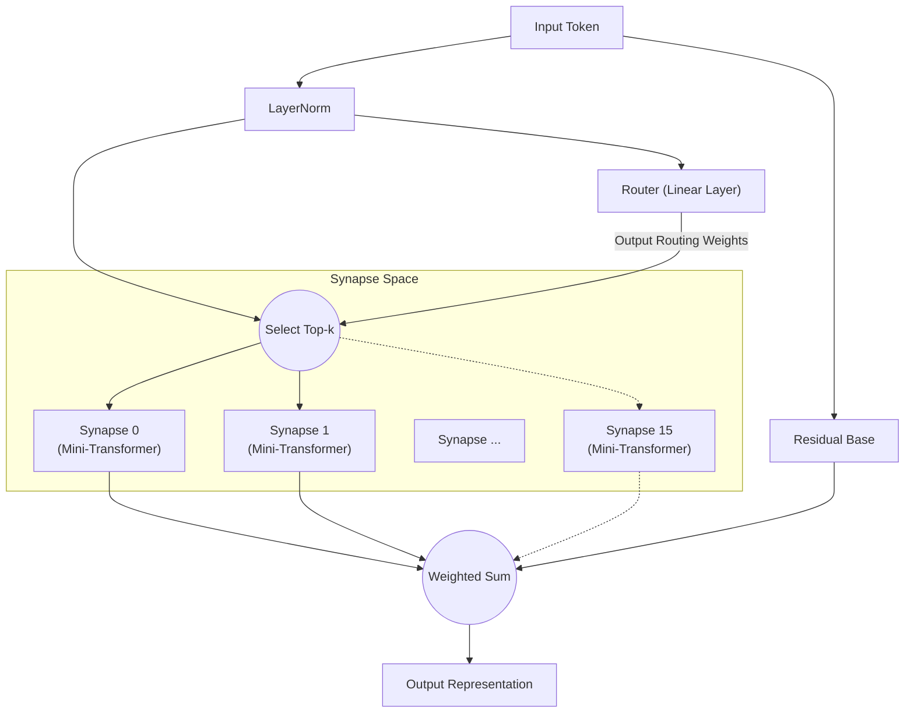

# All You Need Is Router: النمطية الديناميكية المتفرقة في الشبكات العصبية

**Jun Suzuki**، باحث مستقل

## Abstract
في السنوات الأخيرة، أصبحت نماذج التعلم العميق ضخمة بشكل متزايد، مما أدى إلى نمو هائل في الموارد الحسابية المطلوبة للتدريب. علاوة على ذلك، عندما يتم تدريب شبكة أحادية متراصة واحدة على مهام متعددة ذات خصائص مختلفة، فإنها تكون عرضة بشكل كبير لـ"النسيان الكارثي" (Catastrophic Forgetting). كحل لهذه المشكلة، نقترح "بنية التوجيه المشبكي (SRA)". نثبت تجريبياً أن "موجهاً بطبقة واحدة" بسيطاً للغاية بدون أي آلية Attention يمكنه توزيع المهام بشكل مستقل على نماذج صغيرة متعددة (المشابك)، متجنباً النسيان الكارثي بالكامل. في الخلاصة، ما كان مطلوباً حقاً لتعلم المهام المعقدة في وقت واحد لم يكن Transformer ضخماً وكثيفاً، بل "موجه" يختار الوحدات المناسبة بناءً على المدخلات.

## 1. Introduction
منذ تقديم "Attention Is All You Need"، هيمنت بنية Transformer على كل مجال تقريباً، من معالجة اللغة الطبيعية إلى رؤية الحاسوب والتعلم المعزز. ومع ذلك، فإن النهج التقليدي لتنشيط المعاملات بشكل كثيف يؤدي إلى زيادة أسية في التكاليف الحسابية مع توسيع النماذج.
مؤخراً، حظي مزيج الخبراء (MoE)، كما روجت له نماذج مثل Mixtral، باهتمام كبير. يدفع SRA مفهوم MoE هذا إلى أبعد من ذلك من خلال تصميم شبكة مكونة من "وحدات حسابية صغيرة (مشابك)" و"موجه خفيف يجمعها ديناميكياً". في هذه الورقة، نتحقق من فرضية أن "الموجه هو الدماغ الحقيقي للنموذج في التعلم متعدد المهام".

## 2. Architecture (SRA)
SRA هي بنية ديناميكية ومتفرقة مستوحاة من الدماغ البيولوجي. بدلاً من Transformer ضخم، يتم بناؤها من مزيج من مكونات خفيفة الوزن للغاية.

### 2.1 The Router (All You Need Is Router)
قلب SRA وجوهرها هو الموجه. الموجه نفسه لا يمتلك أي آليات معقدة مثل Attention؛ شكله الحقيقي هو **مجرد طبقة خطية واحدة**.
يحسب الموجه حاصل الضرب النقطي (تشابه جيب التمام) بين الحالة المخفية لبيانات الإدخال و"متجه السمات (التضمين)" الفريد الذي يمتلكه كل مشبك، محدداً بسرعة المشابك Top-k ذات أعلى الدرجات (أفضل التطابقات).

### 2.2 Tiny Synapses
كل مشبك هو وحدة صغيرة مستقلة تتكون من طبقة Multi-Head Attention صغيرة وMLP. نظراً لأن الحسابات تُنفذ فقط بواسطة المشابك المختارة من قبل الموجه، يحقق SRA كفاءة حسابية عالية للغاية.

### 2.3 Architecture Diagram
يوضح الرسم البياني أدناه التدفق حيث يتم تقييم المدخل بواسطة الموجه وتوجيهه إلى المشابك المثلى.

## 3. Experiment 1: Algorithmic Reasoning
للتحقق مما إذا كان الموجه يمكنه تمييز المهام المختلفة بشكل مستقل، قمنا بتدريب نموذج SRA واحد في وقت واحد على أربع مهام استدلال خوارزمي ذات خصائص مختلفة تماماً (`copy`، `reverse`، `paren`، `addmod`).

### النتائج
بعد 10,000 خطوة من التدريب المشترك، حقق النموذج **دقة 100% (استدلال مثالي)** عبر جميع المهام.
علاوة على ذلك، باستخراج المشابك التي استخدمها الموجه لكل مهمة (توزيع التوجيه) وتحليل تشابه جيب التمام بين المهام، حصلنا على نتائج ملفتة.

**تجميع المهام بواسطة الموجه (في الطبقات العميقة):**
- **مجموعة معالجة التسلسلات**: `COPY` و`REVERSE` (تشابه 0.969)
- **مجموعة الحساب/المنطق**: `PAREN` و`ADDMOD` (تشابه 0.858)
- تراوح التشابه بين هاتين المجموعتين من 0.029 إلى 0.336، مما يُظهر فصلاً واضحاً.

بدون أي تعليمات بشرية، ميّز الموجه بشكل مستقل بين "المهام التي تعيد ترتيب التسلسلات" و"المهام التي تتطلب المنطق أو الحساب". شارك ديناميكياً المشابك للمهام المتشابهة مع فصل الوحدات بشكل صريح بتوجيه المهام المختلفة تماماً إلى مشابك مختلفة.

## 4. Experiment 2: Cross-Domain Language Modeling
بعد ذلك، أجرينا تجربة أكثر تحدياً بكثير في "نمذجة اللغة عبر المجالات". قمنا بتدريب النموذج في وقت واحد على ثلاثة مجالات بقواعد نحوية ومفردات مختلفة تماماً: `Code` (Python)، `Math` (LaTeX)، و`Text` (اللغة الطبيعية).

### النتائج
على الرغم من 1,000 خطوة تدريب فقط، تمكن النموذج من استنتاج وتوليد مسافات Python البادئة، وتدوين LaTeX الخاص، وسياق اللغة الطبيعية بشكل مثالي.

**تطور استخدام المشابك والتخصص:**
خلال المراحل الأولى من التدريب (Warmup)، استُخدمت جميع المشابك بشكل متساوٍ. ومع ذلك، مع نهاية التدريب، أكمل الموجه "فصلاً حسب المجال" كما يلي:
- معالجة `Code`: يهيمن عليها **المشبك 8**
- معالجة `Math`: يتولاها **المشبكان 10 و13**
- معالجة `Text`: يتولاها **المشبكان 0 و15**

حتى في سيناريو حيث سيعاني نموذج متراص من النسيان الكارثي، نجح الموجه في تقليل التداخل المتبادل من خلال تخصيص مشابك متخصصة (فضاءات معاملات مستقلة) لكل مجال.

## 5. Experiment 3: Multilingual Machine Translation
للتحقق بشكل أكبر من النمطية في معالجة اللغة الطبيعية، أجرينا تعلماً متعدد المهام للترجمة الآلية متعددة اللغات باستخدام ثلاث لغات ذات بنى نحوية مختلفة (الإنجليزية: SVO، الفرنسية: SVO، اليابانية: SOV). خلال التدريب، تم استبعاد أزواج "الفرنسية↔اليابانية" عمداً لاختبار التعميم بدون عينات.

### النتائج
**تباعد التوجيه المستقل بناءً على البنية النحوية (SVO/SOV):**
كشف تحليل معدل استخدام المشابك عن تشكّل مستقل لـ"مشابك SVO المشتركة" التي تنشط بشكل كبير أثناء الترجمة بين الإنجليزية والفرنسية (كلاهما SVO)، و"مشابك SOV المتخصصة" التي يرتفع استخدامها فقط عند الترجمة إلى اليابانية (SOV). يشير هذا إلى أن الموجه يعزل ويكتسب ترتيب الكلمات والقواعد النحوية لكل لغة كوحدات مميزة.

**ترجمة بدون عينات والعودة إلى اللغة المحورية:**
عند طلب الترجمة غير المرئية "الفرنسية→اليابانية"، أظهر النموذج سلوكاً متقدماً للغاية نموذجياً لنماذج متعددة اللغات بدون عينات: عاد إلى إنتاج "الإنجليزية"، التي اكتسبها كتمثيل كامن مشترك (محور) لكلتا اللغتين. هذا دليل على أن SRA لا يحفظ الأزواج فحسب، بل يبني فضاءً دلالياً عابراً للغات.

## 6. Experiment 4: Decision Transformer (Offline RL)
أخيراً، لإثبات أن SRA قابل للتطبيق على مجالات تتجاوز اللغة الطبيعية، قيّمناه كـDecision Transformer مدرب على بيانات مسارات غير متصلة من التعلم المعزز (RL). تم تغذية النموذج بسجلات اللعب (تسلسلات الحالات والأفعال والمكافآت) من بيئتين بقواعد مختلفة تماماً: مهمة "Treasure" (التنقل نحو هدف) ومهمة "Escape" (الفرار من عدو).

### النتائج
كشفت تصور التوجيه رمزاً برمز عن ظاهرة مذهلة: **الفصل الكامل بين "الإدراك" و"السياسة"**.
- **رموز الحالة:** عند إدخال رموز تشير إلى إحداثيات الوكيل، **وجّهها الموجه دائماً إلى مشبك محدد (Expert 1)**، بغض النظر عن نوع المهمة. يُظهر هذا أن نموذج البيئة لـ"الإدراك المكاني" مشترك بالكامل بين المهام.
- **رموز الفعل:** ومع ذلك، في خطوات توليد الفعل التالي (مثل UP/LEFT)، تباعد الموجه بوضوح، موجهاً إلى مشبك سياسة لـTreasure أو مشبك سياسة مختلف لـEscape.

بدون أي تصميم بشري، اكتسب SRA بشكل مستقل البنية النمطية المثالية للتعلم المعزز: "إدراك البيئة بنفس العيون، لكن اتخاذ القرارات بأدمغة مختلفة".

## 7. Conclusion
من خلال بنية التوجيه المشبكي (SRA)، أظهرت هذه الورقة إمكانية تحول نموذجي من "الحساب الدفعي بنموذج ضخم" إلى "الاختيار الديناميكي لوحدات صغيرة".
كما تُظهر النتائج التجريبية المتنوعة في الاستدلال الخوارزمي، ونمذجة اللغة عبر المجالات، والترجمة الآلية متعددة اللغات، والتعلم المعزز القائم على Decision Transformer، فإن ما هو مطلوب حقاً لمنع التداخل متعدد المهام، وعزل المنطق والسياسات الخاصة بكل مهمة، ومشاركة فضاءات الإدراك والكامنة المشتركة، ليس تضخيم آليات Attention المعقدة، بل وجود "موجه" بسيط وذكي. بالفعل، **"All You Need Is Router"**.

## Appendix: Interactive Demos

قمنا بإعداد عروض Jupyter Notebook حيث يمكنك تشغيل وتجربة بنية SRA والنتائج التجريبية المناقشة في هذه الورقة بشكل تفاعلي مباشرة في متصفحك. جرّبها بحرية بفتح Google Colab من الشارات أدناه.

- **1. البنية الأساسية والتحقق من التوجيه** 
  
- **2. تعلم مهمة واحدة وتخصص التوجيه** 
  
- **3. التعلم متعدد المهام والتوجيه الخاص بالمهام** 
  
- **4. Decision Transformer: فصل الإدراك والفعل** 
  
- **5. [لا تفوّت] تجربة آفة المشابك** 
  

## Appendix: Detailed Technical Reports

للحصول على بيانات خام أكثر تفصيلاً وسجلات وعملية التصميم المعماري المتعلقة بتجارب هذه الورقة، يرجى الرجوع إلى التقارير الفنية التالية (Markdown) في المستودع.

- **[SRA GPU Optimization & Benchmarking Report](./dev/SRA_GPU_Optimization_Report.md)**
  - مقارنة الأداء (سرعة التدريب، استهلاك VRAM، تقدم الدقة) بين خطوط الأساس (Transformer/MLP) وSRA، مع نتائج التحقق من ثلاثة نُهج مختلفة لتنفيذ SRA (Batched/MoE/Seq).
- **[Multilingual Translation Routing Analysis](./dev/multilingual_translation_routing_analysis.md)**
  - تحليل التفرع المشبكي المستقل بناءً على البنى النحوية SVO/SOV في الترجمة الآلية متعددة اللغات (الإنجليزية، الفرنسية، اليابانية) وسلوك التوجيه أثناء الترجمة بدون عينات.
- **[Decision Transformer Routing Analysis](./dev/decision_transformer_routing_analysis.md)**
  - تحليل التعلم المعزز غير المتصل في مهام GridWorld. تفاصيل حول فصل مشابك السياسة حسب المهمة وفصل الإدراك والفعل بناءً على رموز "الحالة والمكافأة والفعل".
