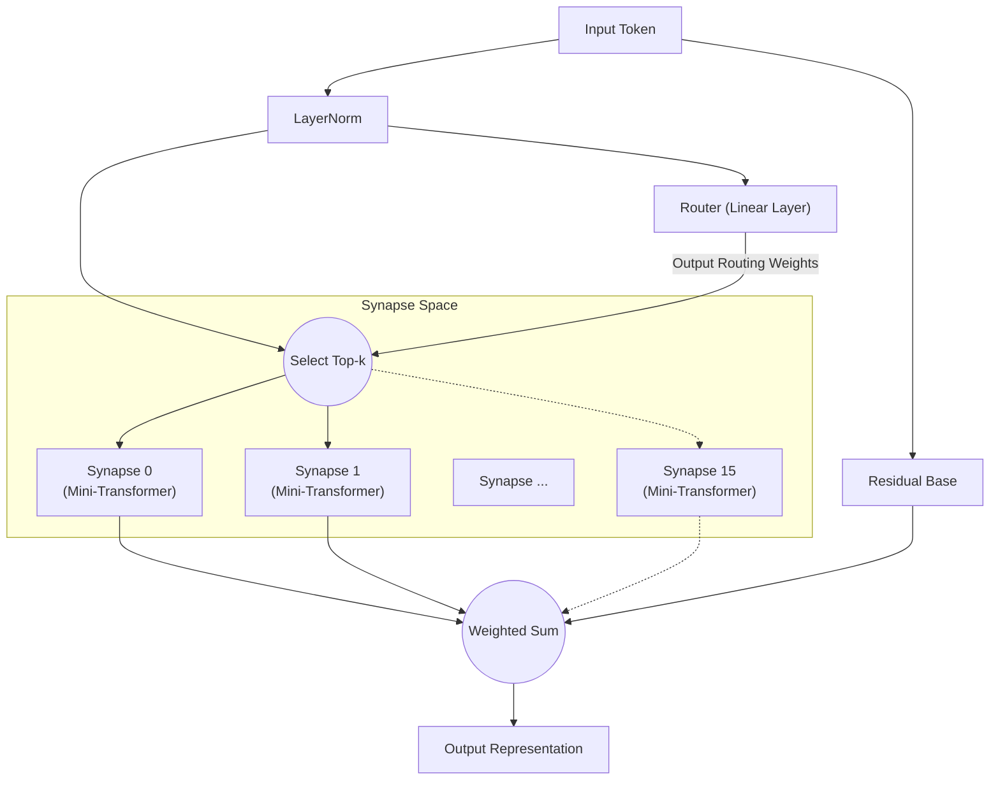

```mermaid
graph TD
    X[Input Token] --> Base[Residual Base]
    X --> Norm[LayerNorm]
    
    Norm --> Router["Router (Linear Layer)"]
    Norm --> Selector
    
    subgraph SynapseSpaceGroup [Synapse Space]
        Selector((Select Top-k))
        S1["Synapse 0<br/>(Mini-Transformer)"]
        S2["Synapse 1<br/>(Mini-Transformer)"]
        S3["Synapse ..."]
        Sn["Synapse 15<br/>(Mini-Transformer)"]
    end
    
    Router -- "Output Routing Weights" --> Selector
    Selector --> S1
    Selector --> S2
    Selector -.-> Sn
    
    S1 --> Combine((Weighted Sum))
    S2 --> Combine
    Sn -.-> Combine
    
    Base --> Combine
    Combine --> Out[Output Representation]
```
