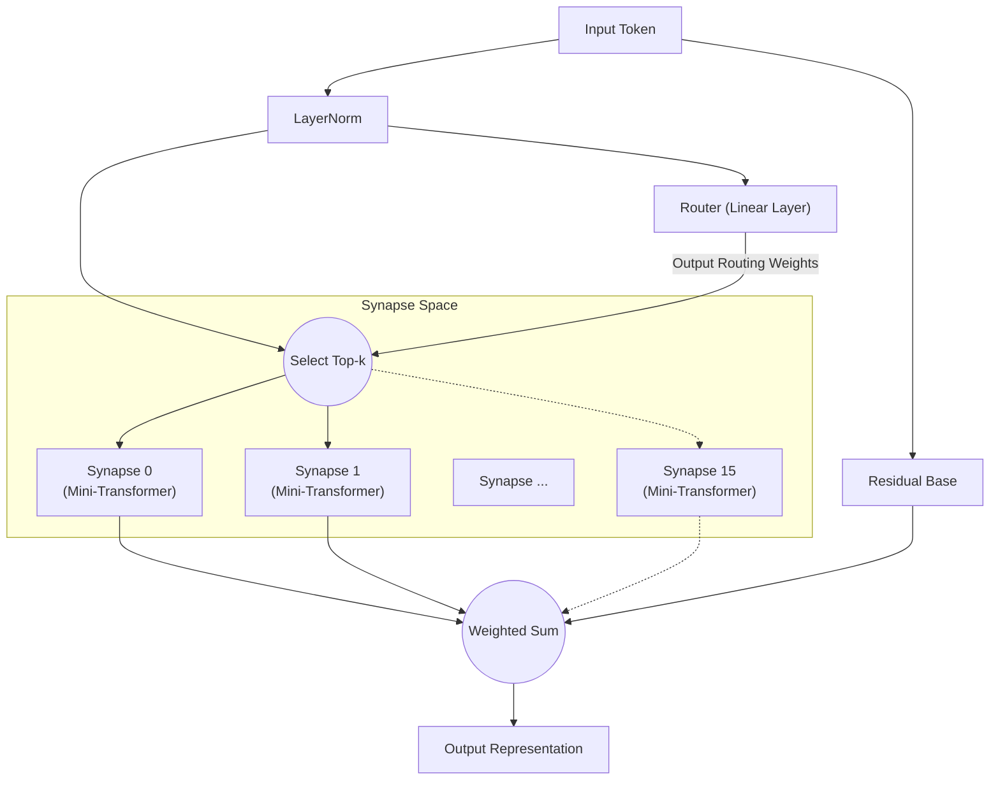

# All You Need Is Router: Dynamische Sparse Modularität in Neuronalen Netzen

**Jun Suzuki**, Unabhängiger Forscher

## Abstract
In den letzten Jahren sind Deep-Learning-Modelle immer größer geworden, was zu einem explosionsartigen Anstieg der für das Training erforderlichen Rechenressourcen geführt hat. Darüber hinaus ist ein einzelnes monolithisches Netzwerk, das gleichzeitig auf mehreren Aufgaben mit unterschiedlichen Eigenschaften trainiert wird, sehr anfällig für „katastrophales Vergessen" (Catastrophic Forgetting). Als Lösung für dieses Problem schlagen wir die „Synaptic Routing Architecture (SRA)" vor. Wir demonstrieren experimentell, dass ein extrem einfacher „einschichtiger Router" ohne jeden Attention-Mechanismus Aufgaben autonom an mehrere winzige Modelle (Synapsen) verteilen kann und so katastrophales Vergessen vollständig vermeidet. Zusammenfassend war das, was wirklich benötigt wurde, um komplexe Aufgaben gleichzeitig zu lernen, kein massiver, dichter Transformer, sondern ein „Router", der basierend auf der Eingabe geeignete Module auswählt.

## 1. Introduction
Seit der Einführung von „Attention Is All You Need" hat die Transformer-Architektur nahezu jeden Bereich dominiert — von der natürlichen Sprachverarbeitung über Computer Vision bis hin zum Reinforcement Learning. Allerdings führt der konventionelle Ansatz der dichten Parameteraktivierung zu einem exponentiellen Anstieg der Rechenkosten bei der Skalierung.
In jüngster Zeit hat Mixture of Experts (MoE), wie es durch Modelle wie Mixtral populär wurde, erhebliche Aufmerksamkeit erlangt. SRA treibt dieses MoE-Konzept noch weiter voran, indem es ein Netzwerk aus „winzigen Recheneinheiten (Synapsen)" und einem „leichtgewichtigen Router, der sie dynamisch kombiniert" entwirft. In diesem Artikel überprüfen wir die Hypothese, dass „der Router das wahre Gehirn des Modells beim Multitask-Lernen ist."

## 2. Architecture (SRA)
SRA ist eine dynamische und sparse Architektur, inspiriert vom biologischen Gehirn. Anstelle eines massiven Transformers wird sie aus einer Kombination extrem leichtgewichtiger Komponenten aufgebaut.

### 2.1 The Router (All You Need Is Router)
Das Herzstück von SRA ist der Router. Der Router selbst besitzt keine komplexen Mechanismen wie Attention; seine wahre Form ist **lediglich eine einzelne lineare Schicht**.
Der Router berechnet das Skalarprodukt (Kosinusähnlichkeit) zwischen dem verborgenen Zustand der Eingabedaten und dem einzigartigen „Merkmalsvektor (Embedding)" jeder Synapse und bestimmt schnell die Top-k Synapsen mit den höchsten Scores (besten Übereinstimmungen).

### 2.2 Tiny Synapses
Jede Synapse ist ein unabhängiges, winziges Modul, bestehend aus einer kleinen Multi-Head-Attention-Schicht und einem MLP. Da nur die vom Router ausgewählten Synapsen Berechnungen durchführen, erreicht SRA eine extrem hohe Recheneffizienz.

### 2.3 Architecture Diagram
Das folgende Diagramm veranschaulicht den Ablauf, bei dem eine Eingabe vom Router bewertet und an die optimalen Synapsen weitergeleitet wird.

## 3. Experiment 1: Algorithmisches Reasoning
Um zu überprüfen, ob der Router verschiedene Aufgaben autonom unterscheiden kann, trainierten wir ein einzelnes SRA-Modell gleichzeitig auf vier algorithmischen Reasoning-Aufgaben mit völlig unterschiedlichen Eigenschaften (`copy`, `reverse`, `paren`, `addmod`).

### Ergebnisse
Nach 10.000 Schritten gemeinsamen Trainings erreichte das Modell über alle Aufgaben hinweg eine **Genauigkeit von 100 % (perfekte Inferenz)**.
Darüber hinaus extrahierten wir, welche Synapsen der Router für welche Aufgaben verwendete (die Routing-Verteilung), und analysierten die Kosinusähnlichkeit zwischen den Aufgaben — mit bemerkenswerten Ergebnissen.

**Aufgaben-Clustering durch den Router (in tiefen Schichten):**
- **Sequenzmanipulationsgruppe**: `COPY` und `REVERSE` (Ähnlichkeit 0,969)
- **Berechnungs-/Logikgruppe**: `PAREN` und `ADDMOD` (Ähnlichkeit 0,858)
- Die Ähnlichkeit zwischen diesen beiden Gruppen lag zwischen 0,029 und 0,336 — eine klare Trennung.

Ohne jegliche menschliche Anweisungen unterschied der Router autonom zwischen „Aufgaben, die Sequenzen umordnen" und „Aufgaben, die Logik oder Berechnung erfordern". Er teilte dynamisch Synapsen für ähnliche Aufgaben, während er Module für völlig verschiedene Aufgaben explizit trennte.

## 4. Experiment 2: Cross-Domain Language Modeling
Als Nächstes führten wir ein deutlich anspruchsvolleres Experiment zur „domänenübergreifenden Sprachmodellierung" durch. Wir trainierten das Modell gleichzeitig auf drei Domänen mit völlig unterschiedlichen Grammatiken und Vokabularen: `Code` (Python), `Math` (LaTeX) und `Text` (natürliche Sprache).

### Ergebnisse
Trotz nur 1.000 Trainingsschritten war das Modell in der Lage, Python-Einrückungen, spezielle LaTeX-Notation und natürlichsprachlichen Kontext perfekt zu erschließen und zu generieren.

**Entwicklung der Synapsennutzung und Spezialisierung:**
In den frühen Trainingsphasen (Warmup) wurden alle Synapsen gleichmäßig genutzt. Gegen Ende des Trainings hatte der Router jedoch eine „domänenbasierte Aufteilung" wie folgt abgeschlossen:
- `Code`-Verarbeitung: Dominiert von **Synapse 8**
- `Math`-Verarbeitung: Übernommen von **Synapsen 10 und 13**
- `Text`-Verarbeitung: Übernommen von **Synapsen 0 und 15**

Selbst in einem Szenario, in dem ein monolithisches Modell unter katastrophalem Vergessen leiden würde, minimierte der Router die gegenseitige Interferenz erfolgreich, indem er jeder Domäne spezialisierte Synapsen (unabhängige Parameterräume) zuwies.

## 5. Experiment 3: Multilinguale maschinelle Übersetzung
Um die Modularität in der natürlichen Sprachverarbeitung weiter zu verifizieren, führten wir Multitask-Lernen für multilinguale maschinelle Übersetzung mit drei Sprachen unterschiedlicher syntaktischer Strukturen durch (Englisch: SVO, Französisch: SVO, Japanisch: SOV). Während des Trainings wurden die Paare „Französisch↔Japanisch" absichtlich ausgeschlossen, um Zero-Shot-Generalisierung zu testen.

### Ergebnisse
**Autonome Routing-Divergenz basierend auf syntaktischer Struktur (SVO/SOV):**
Die Analyse der Synapsennutzungsrate zeigte die autonome Bildung von „SVO-geteilten Synapsen", die bei der Übersetzung zwischen Englisch und Französisch (beide SVO) stark aktiviert werden, und „SOV-spezialisierten Synapsen", deren Nutzung nur bei der Übersetzung ins Japanische (SOV) ansteigt. Dies zeigt, dass der Router Wortstellung und syntaktische Regeln für jede Sprache als eigenständige Module isoliert und erwirbt.

**Zero-Shot-Übersetzung und Pivot-Sprachen-Fallback:**
Bei der Anforderung der ungesehenen Übersetzung „Französisch→Japanisch" zeigte das Modell ein hochentwickeltes Verhalten, typisch für Zero-Shot-multilinguale Modelle: Es fiel auf die Ausgabe von „Englisch" zurück, das es als gemeinsame latente Repräsentation (Hub) für beide Sprachen erworben hatte. Dies belegt, dass SRA nicht einfach Paare auswendig lernt, sondern einen sprachübergreifenden semantischen Raum konstruiert.

## 6. Experiment 4: Decision Transformer (Offline RL)
Schließlich evaluierten wir SRA als Decision Transformer, trainiert auf Offline-Trajektoriendaten aus dem Reinforcement Learning (RL), um zu zeigen, dass SRA auch auf Domänen jenseits natürlicher Sprache anwendbar ist. Das Modell erhielt Spielprotokolle (Sequenzen von Zuständen, Aktionen und Belohnungen) aus zwei Umgebungen mit völlig unterschiedlichen Regeln: einer „Treasure"-Aufgabe (Navigation zu einem Ziel) und einer „Escape"-Aufgabe (Flucht vor einem Feind).

### Ergebnisse
Die tokenweise Visualisierung des Routings offenbarte ein erstaunliches Phänomen: **die vollständige Trennung von „Wahrnehmung" und „Policy"**.
- **Zustandstokens:** Wenn Tokens, die die eigenen Koordinaten des Agenten anzeigen, eingegeben wurden, leitete der Router sie **ausnahmslos zu einer bestimmten Synapse (Expert 1)**, unabhängig vom Aufgabentyp. Dies zeigt, dass das Umweltmodell für „räumliche Wahrnehmung" perfekt zwischen den Aufgaben geteilt wird.
- **Aktionstokens:** Bei den Schritten zur Generierung der nächsten Aktion (z.B. UP/LEFT) divergierte der Router jedoch klar und leitete zu einer Policy-Synapse für Treasure oder einer anderen Policy-Synapse für Escape.

Ohne jegliches menschliches Design erwarb SRA autonom die ideale modulare Struktur für Reinforcement Learning: „Die Umwelt mit denselben Augen wahrnehmen, aber mit verschiedenen Gehirnen entscheiden."

## 7. Conclusion
Durch die Synaptic Routing Architecture (SRA) hat dieser Artikel das Potenzial für einen Paradigmenwechsel demonstriert — von der „Stapelberechnung mit einem massiven Modell" zur „dynamischen Auswahl winziger Module".
Wie die vielfältigen experimentellen Ergebnisse in algorithmischem Reasoning, domänenübergreifender Sprachmodellierung, multilingualer maschineller Übersetzung und Decision-Transformer-basiertem Reinforcement Learning belegen: Was wirklich benötigt wird, um Multitask-Interferenz zu verhindern, aufgabenspezifische Logik und Policies zu isolieren und gemeinsame Wahrnehmungs- und latente Räume zu teilen, ist nicht die Vergrößerung komplexer Attention-Mechanismen, sondern die Existenz eines einfachen und intelligenten „Routers". In der Tat, **„All You Need Is Router."**

## Appendix: Interactive Demos

Wir haben Jupyter-Notebook-Demos vorbereitet, mit denen Sie die in diesem Artikel diskutierte SRA-Architektur und die experimentellen Ergebnisse interaktiv direkt in Ihrem Browser ausführen und erleben können. Probieren Sie sie gerne aus, indem Sie Google Colab über die untenstehenden Badges öffnen.

- **1. Grundstruktur und Routing-Validierung** 
  
- **2. Einzelaufgaben-Lernen und Routing-Spezialisierung** 
  
- **3. Multitask-Lernen und aufgabenspezifisches Routing** 
  
- **4. Decision Transformer: Trennung von Wahrnehmung und Aktion** 
  
- **5. [Unbedingt ansehen] Synaptisches Läsionsexperiment** 
  

## Appendix: Detailed Technical Reports

Für detailliertere Rohdaten, Protokolle und den architektonischen Designprozess zu den Experimenten in diesem Artikel konsultieren Sie bitte die folgenden technischen Berichte (Markdown) im Repository.

- **[SRA GPU Optimization & Benchmarking Report](./dev/SRA_GPU_Optimization_Report.md)**
  - Leistungsvergleich (Trainingsgeschwindigkeit, VRAM-Verbrauch, Genauigkeitsentwicklung) zwischen Baselines (Transformer/MLP) und SRA sowie Validierungsergebnisse dreier verschiedener SRA-Implementierungsansätze (Batched/MoE/Seq).
- **[Multilingual Translation Routing Analysis](./dev/multilingual_translation_routing_analysis.md)**
  - Analyse der autonomen synaptischen Verzweigung basierend auf SVO/SOV-syntaktischen Strukturen bei multilingualer maschineller Übersetzung (Englisch, Französisch, Japanisch) und des Routing-Verhaltens bei Zero-Shot-Übersetzung.
- **[Decision Transformer Routing Analysis](./dev/decision_transformer_routing_analysis.md)**
  - Analyse des Offline-Reinforcement-Learnings in GridWorld-Aufgaben. Details zur Trennung der Policy-Synapsen pro Aufgabe und zur Trennung von Wahrnehmung und Aktion basierend auf „Zustand, Belohnung und Aktion"-Tokens.
