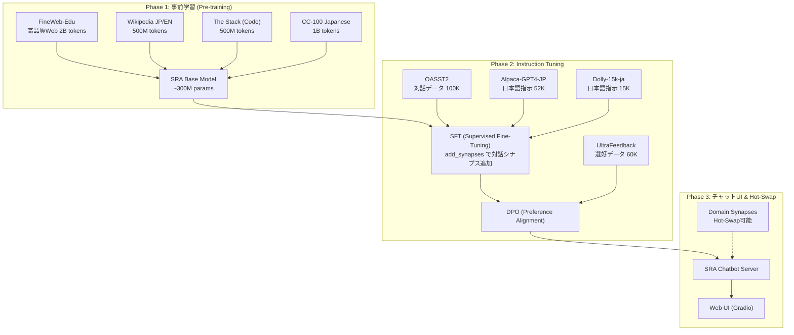

# SRA ベース中規模LLMチャットボット構築計画

## 背景と目的

Synaptic Routing Architecture (SRA) を用いて、**実用的なチャットボット** を構築する。
これまでのSRA実験（アルゴリズム推論、多言語翻訳、Hot-Swap、Synapse Deletion等）で得られた知見を統合し、
「SRAが実際のチャットボットとしてどこまで実用的に機能するか」を検証することが最終目標である。

### SRAが従来LLMに対して持つ理論的優位性
- **モジュール性**: ドメインごとにシナプスが専門化 → 幻覚の低減
- **Hot-Swap**: 学習済みの知識モジュールをゼロショットで着脱可能
- **スパース計算**: 全パラメータの一部のみ使用 → 計算効率が高い
- **破局的忘却の回避**: 新しい知識を追加しても既存知識を破壊しない

---

## ターゲット環境

| 項目 | 仕様 |
|:---|:---|
| **マシン** | **Mac M4 Pro 10コア / ユニファイドメモリ 64GB** |
| **GPU バックエンド** | MPS (Metal Performance Shaders) |
| **用途** | **日常会話 ＋ プログラミング支援** |
| **言語** | **日英バイリンガル** |
| **費用** | **$0**（手持ちMac使用） |

### M4 Pro 64GB の制約と最適化戦略

- ユニファイドメモリ 64GB は CPU/GPU 共有 → 実質的に学習時に使えるGPUメモリは **~40GB** 程度
- MPS バックエンドは FlashAttention 非対応、BF16 部分対応
- CUDA 専用ライブラリ（DeepSpeed, MegaBlocks等）は使用不可
- 単一デバイスのため、データ並列・テンソル並列は不可

#### メモリ予算の見積もり

| 用途 | メモリ使用量 |
|:---|:---|
| モデルパラメータ (FP32) | ~1.2 GB (~300M params) |
| 勾配 (FP32) | ~1.2 GB |
| オプティマイザ (AdamW states) | ~2.4 GB |
| アクティベーション（Gradient Checkpointing あり） | ~8 GB |
| データバッファ / OS等 | ~10 GB |
| **合計** | **~23 GB** (64GB中) |

→ **~300M パラメータ** が M4 Pro 64GB の現実的な上限。バッチサイズとシーケンス長で余裕を確保する。

---

## 全体アーキテクチャ



---

## Phase 1: 事前学習 (Pre-training)

### 1.1 モデル設計

現在の `MoESRALanguageModel` をスケールアップする。
M4 Pro 64GB で学習可能な最大サイズに最適化。

| パラメータ | 現行 (実験用) | **M4 Pro 構成** |
|:---|:---:|:---:|
| `dim` | 128 | **768** |
| `layers` | 2 | **8** |
| `num_synapses` | 16 | **32** |
| `k` (top-k) | 2 | **2** |
| `syn_hidden` | 256 | **1536** |
| `max_seq_len` | 64 | **1024** |
| `vocab_size` | ~100K (tiktoken) | **32000 (SentencePiece)** |
| **総パラメータ** | ~2M | **~300M** |
| **アクティブパラメータ** | - | **~40M** (top-2/32) |
| 学習トークン数 | ~10K | **~4B** |

**SRAの強み**: 総パラメータ 300M でも、推論時のアクティブパラメータは約 40M。
これは同サイズの Dense モデル（GPT-2 Medium相当）よりも遥かにパラメータ効率が高い。
SRAの 300M は、Dense モデル換算で「知識容量は 300M 級だが、推論コストは 40M 級」という独自の位置づけになる。

#### 期待される品質水準（正直な見通し）
- 300M パラメータの SRA は、知識量では GPT-2 (124M Dense) を大幅に上回る
- 日常会話では「まともに文が繋がり、ある程度質問に答えられる」レベルを目標
- GPT-3.5 や ChatGPT には遠く及ばないが、**SRA のモジュール性（シナプス着脱・専門化）を実証するデモとしては十分**
- プログラミング支援は「簡単なコードスニペットの生成・説明」程度に留まる見込み

### 1.2 トークナイザ

現在の `tiktoken (cl100k_base)` は英語偏重であるため、日英バイリンガル用のトークナイザに変更する。

**推奨**: **SentencePiece BPE (vocab_size=32000)**
- 日本語・英語の両方を効率的にトークン化可能
- 学習データから独自にトークナイザを構築
- 参考: Llama 2/3 の SentencePiece

#### 実装方針
```python
# 新規: src/tokenizer/train_tokenizer.py
import sentencepiece as spm

spm.SentencePieceTrainer.train(
    input='data/pretrain/combined_text.txt',  # 事前学習データのサンプル (~1GB程度)
    model_prefix='sra_tokenizer',
    vocab_size=32000,
    model_type='bpe',
    character_coverage=0.9995,  # 日本語の漢字カバー
    user_defined_symbols=['<|user|>', '<|assistant|>', '<|system|>', '<|end|>'],
    pad_id=0, unk_id=1, bos_id=2, eos_id=3,
)
```

### 1.3 学習データ

**合計目標: ~4B トークン**（Chinchilla最適則: 300M params × ~13 = ~4B tokens）

| データソース | 言語 | 規模 | 用途 | 入手方法 |
|:---|:---:|:---:|:---|:---|
| **FineWeb-Edu** | EN | ~2B tokens | 高品質Web（教育的コンテンツ） | `datasets.load_dataset("HuggingFaceFW/fineweb-edu", streaming=True)` |
| **CC-100 Japanese** | JP | ~1B tokens | 日本語Webテキスト | `datasets.load_dataset("cc100", lang="ja")` |
| **Wikipedia** | JP+EN | ~500M tokens | 百科事典的知識 | `datasets.load_dataset("wikipedia", "20231101.ja")` |
| **The Stack v2** | Code | ~500M tokens | プログラミング知識（Python中心） | `datasets.load_dataset("bigcode/the-stack-v2-dedup", data_dir="data/Python")` |

すべて Hugging Face 上にある **無料の** オープンデータセットです。
ストリーミングモードを使えば、ローカルディスクへの事前ダウンロードは不要です（ネットワーク帯域に依存）。

#### データ混合比率

```python
DATA_MIX = {
    "fineweb_edu":  0.45,   # 英語Web（高品質・教育的）
    "cc100_ja":     0.25,   # 日本語Web
    "wikipedia":    0.15,   # 百科事典（JP+EN）
    "code":         0.15,   # プログラミングコード（Python中心）
}
```

### 1.4 学習スクリプト

#### [NEW] `src/train_pretrain_chat.py`
既存の `train_mtl_lang.py` の構造を継承しつつ、M4 Pro (MPS) 向けに最適化:

- **Streaming DataLoader**: Hugging Face `datasets` からストリーミングでデータを取得
- **Mixed Precision**: `torch.amp.autocast("mps", dtype=torch.float16)` による FP16 学習
- **Gradient Checkpointing**: メモリを ~50% 削減
- **Gradient Accumulation**: 実効バッチサイズを稼ぐ（micro_batch=8 × accum=8 = 実効 64）
- **Warmup + Cosine LR Schedule**: 安定した学習のために
- **チェックポイント**: 1000ステップごとに自動保存 + 再開機能
- **SRA固有の学習フェーズ**: warmup → joint → stabilize → specialize

```bash
# M4 Pro での学習実行例
python src/train_pretrain_chat.py \
    --dim 768 --layers 8 --synapses 32 --k 2 --syn-hidden 1536 \
    --micro-batch-size 8 --gradient-accumulation 8 --seq-len 1024 \
    --steps 100000 --lr 3e-4 \
    --gradient-checkpointing \
    --save checkpoints/sra_chat_base.pt
```

**学習時間の見積もり（M4 Pro MPS）**:
- 1ステップ（forward + backward + update）: ~0.8〜1.5秒
- 100,000ステップ: **約1〜2日**
- Phase 1 全体: **約2〜3日**

### 1.5 必要なモデル修正

#### [MODIFY] `src/sra_language_models.py`
- **Gradient Checkpointing 対応**: `CausalMoESRABlock.forward` で `torch.utils.checkpoint` を使用可能に
- **RoPE (Rotary Position Embedding)** の導入: 現在の `nn.Embedding` ベースの位置埋め込みを、長いシーケンスに対応できる RoPE に変更
- **RMSNorm の導入**: `LayerNorm` → `RMSNorm` で安定性と速度を改善
- **MPS互換性の確保**: FlashAttention は非対応のため、`nn.MultiheadAttention` のまま利用。ただしMPSで動作確認済みの範囲で最適化。

---

## Phase 2: Instruction Tuning（対話能力の獲得）

### 2.1 チャット用データフォーマット

SRAのチャットボットでは、以下のようなフォーマットでデータを構成する:

```
<|system|>あなたは親切で知識豊富なAIアシスタントです。<|end|>
<|user|>東京タワーの高さは？<|end|>
<|assistant|>東京タワーの高さは333メートルです。1958年に完成し、
当時は世界一高い自立式鉄塔でした。<|end|>
```

### 2.2 学習データ

| データセット | 言語 | サイズ | 内容 | 入手方法 |
|:---|:---:|:---:|:---|:---|
| **OASST2** | 多言語 | ~100K会話 | 人間同士の対話データ | `datasets.load_dataset("OpenAssistant/oasst2")` |
| **Alpaca-GPT4-Japanese** | JP | ~52K | GPT-4生成の日本語指示 | `datasets.load_dataset("shi3z/alpaca_cleaned_ja")` |
| **databricks-dolly-15k-ja** | JP | ~15K | 人手の高品質指示（日本語） | `datasets.load_dataset("kunishou/databricks-dolly-15k-ja")` |
| **Code Alpaca** | EN | ~20K | プログラミング指示-応答 | `datasets.load_dataset("sahil2801/CodeAlpaca-20k")` |

### 2.3 SRA 特有の Instruction Tuning 戦略

**Hot-Swap 対応 SFT**: Phase 1 で獲得した知識シナプスを **凍結（freeze）** し、
新しいシナプスを追加してInstruction Tuning を行う。これにより：
- 事前学習の知識を保護（破局的忘却の回避）
- チャット能力を担当する専門シナプスが自然に分化
- 不要になった場合は `pop_synapses()` で除去可能

```python
# 既存APIをそのまま活用
model = MoESRALanguageModel(...)
model.load_state_dict(torch.load("sra_chat_base.pt"))

# Phase 1 のシナプスを凍結し、チャット用の新シナプスを追加
model.add_synapses(num_new=8, freeze_base=True)
# → 32 (frozen) + 8 (trainable) = 40 synapses
```

#### [NEW] `src/train_sft_chat.py`
- Phase 1 の重みをロード → シナプス追加 → SFT 実行
- 応答部分のみでCross-Entropy Loss を計算（プロンプト部分はマスク）
- **学習時間: ~4〜8時間**（M4 Pro, ~5000ステップ）

### 2.4 DPO（選好アライメント）

#### [NEW] `src/train_dpo_chat.py`
- SFT 後のモデルに対して、人間の選好データで微調整
- `UltraFeedback` データセット（~60K ペア）を使用
- DPO は RLHF より安定・効率的で、SRA との相性が良い
- **学習時間: ~2〜4時間**（M4 Pro, ~2000ステップ）

---

## Phase 3: チャットUI & Hot-Swap デモ

### 3.1 推論サーバー

#### [NEW] `src/chat_server.py`
- **Gradio** ベースのWebチャットUI
- ストリーミング生成（トークンごとの逐次表示）
- **Hot-Swap パネル**: シナプスの着脱を動的にデモ
  - 「コードシナプスを無効化」→ コード関連の応答品質が低下
  - 「日本語シナプスを無効化」→ 日本語応答が不自然に
  - シナプスの着脱がリアルタイムでチャット品質に影響する様子をデモ

```python
import gradio as gr

def chat(message, history, active_synapses):
    # allowed_synapses_mask を動的に構成
    mask = build_synapse_mask(active_synapses)
    response = generate(model, message, allowed_synapses_mask=mask)
    return response

# Gradio UI
with gr.Blocks() as demo:
    chatbot = gr.Chatbot()
    msg = gr.Textbox(label="メッセージを入力")
    synapse_panel = gr.CheckboxGroup(
        choices=["知識", "コード", "日本語", "会話"],
        value=["知識", "コード", "日本語", "会話"],
        label="有効なシナプス"
    )
```

### 3.2 SRA の優位性をデモする機能

1. **シナプス可視化**: 入力に対してどのシナプスが発火しているかリアルタイム表示
2. **Hot-Swap デモ**: シナプスの有効/無効をトグルで切り替え
3. **ドメイン特化**: 特定ドメインのシナプスを `.pt` ファイルからロード
4. **ルーティングヒートマップ**: 各トークンのルーティング先を可視化

---

## ファイル構成（新規・変更）

### 新規ファイル

| ファイル | 説明 |
|:---|:---|
| `src/tokenizer/train_tokenizer.py` | カスタムトークナイザの学習 |
| `src/tokenizer/sra_tokenizer.py` | トークナイザのラッパークラス |
| `src/data/pretrain_loader.py` | 事前学習用ストリーミングデータローダー |
| `src/data/chat_loader.py` | チャットSFT用データローダー |
| `src/train_pretrain_chat.py` | Phase 1: 事前学習スクリプト |
| `src/train_sft_chat.py` | Phase 2a: SFT スクリプト |
| `src/train_dpo_chat.py` | Phase 2b: DPO スクリプト |
| `src/chat_server.py` | Phase 3: Gradio チャットUI |
| `src/chat_generate.py` | 推論ユーティリティ（サンプリング、Top-p等）|
| `configs/pretrain_m4pro.yaml` | M4 Pro 64GB 向け学習設定 |

### 変更ファイル

| ファイル | 変更内容 |
|:---|:---|
| `src/sra_language_models.py` | RoPE、RMSNorm、Gradient Checkpointing 対応 |
| `src/sra_reference.py` | Router の Gumbel-Softmax に温度スケジュール対応追加 |

---

## スケジュールと費用

| 項目 | 仕様 |
|:---|:---|
| **Phase 1 (事前学習)** | ~100K steps / **約2〜3日** |
| **Phase 2 (SFT + DPO)** | ~7K steps / **約8〜12時間** |
| **Phase 3 (UI構築)** | 学習不要 / **数時間の実装** |
| **合計** | **約1週間** |
| **費用** | **$0** |

### タイムライン

| 日 | フェーズ | 作業内容 |
|:---:|:---|:---|
| **1日目** | 準備 | トークナイザ学習、データパイプライン構築、モデル改修（RoPE/RMSNorm等） |
| **2〜4日目** | Phase 1 | 事前学習の実行（M4 Proで約2〜3日放置） |
| **5日目** | Phase 1 評価 | PPL計測、ルーティング分析、中間検証 |
| **6日目** | Phase 2 | SFT + DPO（約半日〜1日） |
| **7日目** | Phase 3 | Gradio UI 構築、Hot-Swap デモ、最終検証 |

---

## 検証プラン

### 自動テスト

1. **Perplexity**: 事前学習モデルの日英テキストに対するPPLを定期計測
2. **ルーティング分析**: シナプスの専門化度合い（エントロピー、使用率ヒートマップ）
3. **簡易ベンチマーク**: 日本語常識Q&A、簡単なコード生成タスク

### 手動検証

1. **Gradio UI でのインタラクティブテスト**: 実際に対話して品質を確認
2. **Hot-Swap デモ**: シナプスの着脱が意図通りに動作するか
3. **ドメイン専門化の確認**: コード質問にコードシナプスが発火するか等
4. **日本語品質**: 自然な日本語が生成されているか

### SRA 固有の検証

1. **Zero Forgetting テスト**: SFT後も事前学習の知識が保持されているか
2. **シナプス削除テスト**: `pop_synapses()` で特定能力だけを除去できるか
3. **推論速度**: Dense モデル比でのスループット比較（スパース計算の恩恵）

---

## セットアップ手順（別のMac用）

### 1. 環境セットアップ

```bash
git clone https://github.com/JunSuzukiJapan/SynapticRouter.git
cd SynapticRouter

# 必要なライブラリをインストール
pip install torch datasets sentencepiece gradio matplotlib seaborn
```

### 2. Phase 1: 事前学習の実行

```bash
# トークナイザの学習（初回のみ）
python src/tokenizer/train_tokenizer.py

# 事前学習の開始
python src/train_pretrain_chat.py \
    --dim 768 --layers 8 --synapses 32 --k 2 --syn-hidden 1536 \
    --micro-batch-size 8 --gradient-accumulation 8 --seq-len 1024 \
    --steps 100000 --lr 3e-4 \
    --gradient-checkpointing \
    --save checkpoints/sra_chat_base.pt
```

### 3. Phase 2: Instruction Tuning

```bash
# SFT（対話学習）
python src/train_sft_chat.py \
    --base-model checkpoints/sra_chat_base.pt \
    --add-synapses 8 \
    --steps 5000 --lr 1e-4 \
    --save checkpoints/sra_chat_sft.pt

# DPO（選好アライメント）
python src/train_dpo_chat.py \
    --base-model checkpoints/sra_chat_sft.pt \
    --steps 2000 --lr 5e-5 \
    --save checkpoints/sra_chat_final.pt
```

### 4. Phase 3: チャットUIの起動

```bash
python src/chat_server.py --model checkpoints/sra_chat_final.pt
# ブラウザで http://localhost:7860 にアクセス
```
