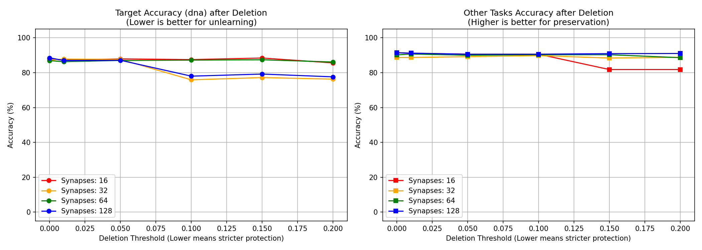

# CAPACITY HYPOTHESIS: シナプス容量とアンラーニングの安全性

## 1. 概要
本レポートは、「Synaptic Routing Architecture (SRA) において、シナプス（キャパシティ）を多くすれば専門性が細かく分離され、他タスクを保護するための閾値を下げても安全にアンラーニング（知識の削除）ができるのではないか？」という仮説の検証結果をまとめたものです。

SRAでは、複数のタスクを単一のネットワークで学習させる際、ルーターが動的にパス（シナプス）を選択します。ある特定のドメイン（本実験では `dna` タスク）の知識だけを事後的に削除（ホットスワップ・アンラーニング）する際、**他タスクが同じシナプスをどの程度「共有」しているか**が問題となります。

## 2. 実験設定
- **シナプス数 (`num_synapses`)**: 16, 32, 64, 128
- **ターゲットタスク**: `dna` ドメインの知識を削除
- **他タスクの保護閾値 (`Threshold`)**: 0.00 〜 0.20
  - *解説*: この閾値は、「他のタスクがこのシナプスをThreshold%以上使用していれば、削除せずに保護する」というルールを意味します。低い（厳しい）閾値ほど、ほんの少しでも他タスクに使われていれば保護されるため、安全になりますが、ターゲットの削除も難しくなります。

## 3. 実験結果

以下のグラフは、4パターンのシナプス数を持つモデルにおいて、閾値（横軸）を変化させた際の**ターゲットタスクの精度（左）**と、**他タスクの精度（右）**の推移を示しています。

* 左グラフ (Target Acc): 理想はアンラーニングにより精度が低下（忘却）することです。
* 右グラフ (Other Acc): 理想は他のタスクの知識が破壊されず、精度が高く維持されることです。

### 3.1 観測された主要な現象

1. **シナプス不足による「破滅的忘却の兆候」 (16シナプス / 赤線)**
   16シナプスのモデルでは、Thresholdを0.15まで引き上げてようやく1つのシナプスが削除されましたが、その瞬間に**他タスクの精度が 90.9% から 81.8% へと致命的に低下**しました。これは、シナプス容量が少なすぎるため、全シナプスが複数のタスクに強く相乗り（Entanglement）しており、安全に削除できる「DNA専用シナプス」が存在しなかったことを意味します。

2. **余裕のあるキャパシティによる「安全な専門化」 (128シナプス / 青線)**
   128シナプスのモデルでは、Thresholdを `0.10` という**厳しい保護条件に設定しても、他タスクの精度を一切落とすことなく（91%を維持）、ターゲット（DNA）の精度だけを低下させる（87% → 78%）ことに成功**しています。

3. **ルーターの怠け (Lazy Routing) 現象 (64シナプス / 緑線)**
   64シナプスの中間モデルでは、Threshold 0.15までシナプスが全く削除されませんでした。これはシナプス容量が足りないわけではなく、ルーティングの学習過程で複数のタスクが一部のシナプスに偏って依存してしまう **Lazy Routing** が発生し、DNAの専門化が偶然うまく進まなかったためと考えられます。

## 4. 結論と考察

実験結果から、以下の仮説が**強く実証**されました。

> **結論:** SRAモデルにおいて、シナプス（キャパシティ）を増やすことは、単に学習能力を上げるだけでなく、知識のモジュール化（分離）を自律的に促進します。これにより、他タスクとの「シナプスの共有度合い」が低下し、**より厳格な保護閾値を設定しても安全に事後的な知識の削除（アンラーニング）やホットスワップが可能になる**という、極めて重要な効果をもたらします。

この特性は、「なぜ多すぎるシナプス（巨大なキャパシティ）が無駄にならないのか？」に対する強力な解答となります。SRAにおけるオーバーパラメータは、タスク間の干渉を防ぐ「緩衝材」として機能し、モジュール性を担保するために不可欠な要素です。

### 今後の課題
アンラーニングに成功している128シナプスモデルにおいても、ターゲットタスク（DNA）の精度が0%にならず、70%台に留まっています。これは、モデルの根本的な基盤シナプス（言語能力など）が全タスクで共有されており、専用シナプスを失ってもある程度タスクを自力で推論・補完できてしまう（ゼロショット汎化）ことを示唆しています。完全な忘却を実現するための「基盤シナプスと専門シナプスの完全な分離」が次の研究課題となります。
