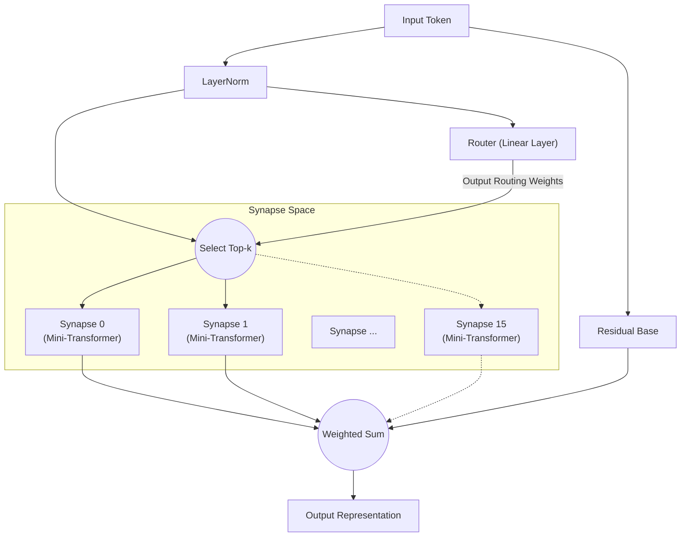

# All You Need Is Router: Modularidad Dinámica y Sparse en Redes Neuronales

**Jun Suzuki**, Investigador Independiente

## Abstract
En los últimos años, los modelos de aprendizaje profundo se han vuelto cada vez más masivos, generando un crecimiento explosivo en los recursos computacionales necesarios para el entrenamiento. Además, cuando se entrena una única red monolítica en múltiples tareas con características diferentes, es altamente susceptible al "olvido catastrófico" (Catastrophic Forgetting). Como solución a este problema, proponemos la "Synaptic Routing Architecture (SRA)". Demostramos experimentalmente que un "enrutador de una sola capa" extremadamente simple, sin ningún mecanismo de Attention, puede distribuir autónomamente las tareas a múltiples modelos diminutos (sinapsis), evitando completamente el olvido catastrófico. En conclusión, lo que realmente se necesitaba para aprender tareas complejas simultáneamente no era un Transformer masivo y denso, sino un "enrutador" que selecciona los módulos apropiados según la entrada.

## 1. Introduction
Desde la introducción de "Attention Is All You Need", la arquitectura Transformer ha dominado casi todos los dominios, desde el procesamiento del lenguaje natural hasta la visión por computadora y el aprendizaje por refuerzo. Sin embargo, el enfoque convencional de activación densa de parámetros conduce a un aumento exponencial de los costos computacionales a medida que los modelos escalan.
Recientemente, el Mixture of Experts (MoE), popularizado por modelos como Mixtral, ha ganado una atención significativa. SRA lleva este concepto de MoE aún más lejos, diseñando una red compuesta por "unidades de cómputo diminutas (sinapsis)" y un "enrutador ligero que las combina dinámicamente". En este artículo, verificamos la hipótesis de que "el Enrutador es el verdadero cerebro del modelo en el aprendizaje multitarea".

## 2. Architecture (SRA)
SRA es una arquitectura dinámica y sparse inspirada en el cerebro biológico. En lugar de un Transformer masivo, se construye a partir de una combinación de componentes extremadamente ligeros.

### 2.1 The Router (All You Need Is Router)
El corazón y pieza fundamental de SRA es el Enrutador. El enrutador en sí no posee ningún mecanismo complejo como Attention; su verdadera forma es **simplemente una única capa lineal**.
El enrutador calcula el producto escalar (similitud coseno) entre el estado oculto de los datos de entrada y el "vector de características (embedding)" único de cada sinapsis, determinando rápidamente las Top-k sinapsis con las puntuaciones más altas (mejores coincidencias).

### 2.2 Tiny Synapses
Cada sinapsis es un módulo diminuto independiente compuesto por una pequeña capa Multi-Head Attention y un MLP. Dado que solo las sinapsis seleccionadas por el enrutador ejecutan cálculos, SRA logra una eficiencia computacional extremadamente alta.

### 2.3 Architecture Diagram
El diagrama a continuación ilustra el flujo donde una entrada es evaluada por el enrutador y dirigida a las sinapsis óptimas.

## 3. Experiment 1: Algorithmic Reasoning
Para verificar si el enrutador puede distinguir autónomamente diferentes tareas, entrenamos un único modelo SRA simultáneamente en cuatro tareas de razonamiento algorítmico con características completamente diferentes (`copy`, `reverse`, `paren`, `addmod`).

### Resultados
Después de 10,000 pasos de entrenamiento conjunto, el modelo alcanzó una **precisión del 100% (inferencia perfecta)** en todas las tareas.
Además, al extraer qué sinapsis utilizó el enrutador para cada tarea (la distribución de enrutamiento) y analizar la similitud coseno entre tareas, obtuvimos resultados notables.

**Agrupación de tareas por el Enrutador (en capas profundas):**
- **Grupo de manipulación de secuencias**: `COPY` y `REVERSE` (similitud 0.969)
- **Grupo de cálculo/lógica**: `PAREN` y `ADDMOD` (similitud 0.858)
- La similitud entre estos dos grupos osciló entre 0.029 y 0.336, mostrando una clara separación.

Sin ninguna instrucción humana, el enrutador distinguió autónomamente entre "tareas que reordenan secuencias" y "tareas que requieren lógica o cálculo". Compartió dinámicamente sinapsis para tareas similares mientras separó explícitamente los módulos dirigiendo tareas completamente diferentes a sinapsis distintas.

## 4. Experiment 2: Cross-Domain Language Modeling
A continuación, realizamos un experimento mucho más desafiante de "modelado de lenguaje entre dominios". Entrenamos simultáneamente el modelo en tres dominios con gramáticas y vocabularios completamente diferentes: `Code` (Python), `Math` (LaTeX) y `Text` (lenguaje natural).

### Resultados
A pesar de solo 1,000 pasos de entrenamiento, el modelo fue capaz de inferir y generar perfectamente la indentación de Python, la notación especial de LaTeX y el contexto de lenguaje natural.

**Evolución del uso de sinapsis y especialización:**
Durante las fases iniciales del entrenamiento (Warmup), todas las sinapsis se utilizaron uniformemente. Sin embargo, hacia el final del entrenamiento, el enrutador había completado una "segregación por dominio" de la siguiente manera:
- Procesamiento de `Code`: dominado por la **Sinapsis 8**
- Procesamiento de `Math`: manejado por las **Sinapsis 10 y 13**
- Procesamiento de `Text`: manejado por las **Sinapsis 0 y 15**

Incluso en un escenario donde un modelo monolítico sufriría olvido catastrófico, el enrutador minimizó exitosamente la interferencia mutua asignando sinapsis especializadas (espacios de parámetros independientes) a cada dominio.

## 5. Experiment 3: Multilingual Machine Translation
Para verificar aún más la modularidad en el procesamiento del lenguaje natural, realizamos aprendizaje multitarea para traducción automática multilingüe usando tres idiomas con estructuras sintácticas diferentes (inglés: SVO, francés: SVO, japonés: SOV). Durante el entrenamiento, los pares "francés↔japonés" fueron excluidos intencionalmente para probar la generalización zero-shot.

### Resultados
**Divergencia autónoma del enrutamiento basada en la estructura sintáctica (SVO/SOV):**
El análisis de la tasa de uso de sinapsis reveló la formación autónoma de "sinapsis compartidas SVO" que se activan fuertemente durante la traducción entre inglés y francés (ambos SVO), y "sinapsis especializadas SOV" cuyo uso aumenta solo al traducir al japonés (SOV). Esto indica que el enrutador aísla y adquiere el orden de palabras y las reglas sintácticas de cada idioma como módulos distintos.

**Traducción zero-shot y recurso al idioma pivote:**
Cuando se le solicitó realizar la traducción no vista "francés→japonés", el modelo exhibió un comportamiento altamente avanzado típico de los modelos multilingües zero-shot: recurrió a producir "inglés", que había adquirido como representación latente común (hub) para ambos idiomas. Esto es evidencia de que SRA no simplemente memoriza pares, sino que construye un espacio semántico translingüístico.

## 6. Experiment 4: Decision Transformer (Offline RL)
Finalmente, para demostrar que SRA es aplicable a dominios más allá del lenguaje natural, lo evaluamos como un Decision Transformer entrenado en datos de trayectorias offline de aprendizaje por refuerzo (RL). El modelo recibió registros de juego (secuencias de estados, acciones y recompensas) de dos entornos con reglas completamente diferentes: una tarea "Treasure" (navegar hacia un objetivo) y una tarea "Escape" (huir de un enemigo).

### Resultados
La visualización del enrutamiento token por token reveló un fenómeno asombroso: **la separación completa de "Percepción" y "Política"**.
- **Tokens de estado:** Cuando se ingresaron tokens que indicaban las coordenadas propias del agente, el enrutador **invariablemente los dirigió a una sinapsis específica (Expert 1)**, independientemente del tipo de tarea. Esto muestra que el modelo ambiental para la "percepción espacial" se comparte perfectamente entre tareas.
- **Tokens de acción:** Sin embargo, en los pasos para generar la siguiente acción (por ej. UP/LEFT), el enrutador divergió claramente, dirigiendo hacia una sinapsis de política para Treasure o una sinapsis de política diferente para Escape.

Sin ningún diseño humano, SRA adquirió autónomamente la estructura modular ideal para el aprendizaje por refuerzo: "Percibir el entorno con los mismos ojos, pero tomar decisiones con cerebros diferentes."

## 7. Conclusion
A través de la Synaptic Routing Architecture (SRA), este artículo demostró el potencial de un cambio de paradigma desde el "cálculo por lotes con un modelo masivo" hacia la "selección dinámica de módulos diminutos".
Como evidencian los diversos resultados experimentales en razonamiento algorítmico, modelado de lenguaje entre dominios, traducción automática multilingüe y aprendizaje por refuerzo basado en Decision Transformer, lo que verdaderamente se necesita para prevenir la interferencia multitarea, aislar lógicas y políticas específicas de cada tarea, y compartir espacios de percepción y latentes comunes, no es el gigantismo de mecanismos de Attention complejos, sino la presencia de un "Enrutador" simple e inteligente. En efecto, **"All You Need Is Router."**

## Appendix: Interactive Demos

Hemos preparado demos de Jupyter Notebook donde puede ejecutar y experimentar interactivamente la arquitectura SRA y los resultados experimentales discutidos en este artículo directamente en su navegador. Siéntase libre de probarlos abriendo Google Colab desde las insignias a continuación.

- **1. Estructura básica y validación del enrutamiento** 
  
- **2. Aprendizaje de tarea única y especialización del enrutamiento** 
  
- **3. Aprendizaje multitarea y enrutamiento específico por tarea** 
  
- **4. Decision Transformer: separación de percepción y acción** 
  
- **5. [Imprescindible] Experimento de lesión sináptica** 
  

## Appendix: Detailed Technical Reports

Para datos brutos más detallados, registros y el proceso de diseño arquitectónico de los experimentos en este artículo, consulte los siguientes informes técnicos (Markdown) en el repositorio.

- **[SRA GPU Optimization & Benchmarking Report](./dev/SRA_GPU_Optimization_Report.md)**
  - Comparación de rendimiento (velocidad de entrenamiento, consumo de VRAM, progresión de precisión) entre líneas base (Transformer/MLP) y SRA, junto con resultados de validación de tres enfoques de implementación SRA diferentes (Batched/MoE/Seq).
- **[Multilingual Translation Routing Analysis](./dev/multilingual_translation_routing_analysis.md)**
  - Análisis de la bifurcación sináptica autónoma basada en estructuras sintácticas SVO/SOV en traducción automática multilingüe (inglés, francés, japonés) y comportamiento de enrutamiento durante la traducción zero-shot.
- **[Decision Transformer Routing Analysis](./dev/decision_transformer_routing_analysis.md)**
  - Análisis del aprendizaje por refuerzo offline en tareas GridWorld. Detalles sobre la separación de sinapsis de política por tarea y la separación de percepción y acción basada en tokens de "Estado, Recompensa y Acción".
