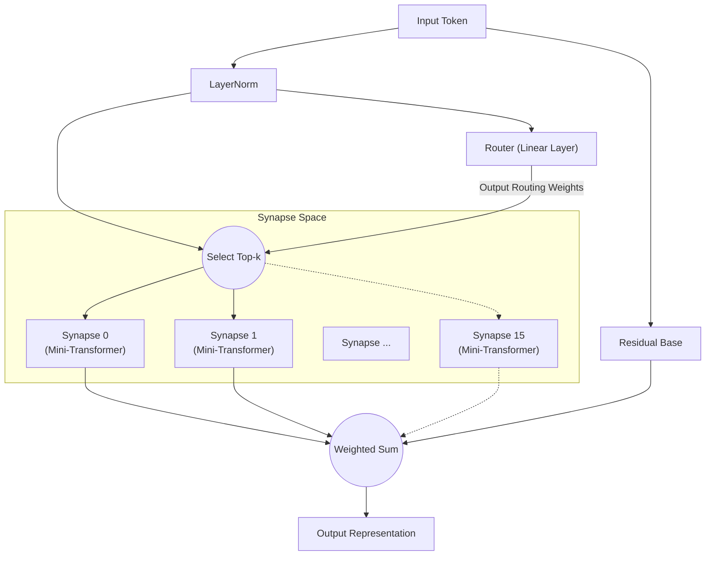

# All You Need Is Router : Modularité Dynamique et Sparse dans les Réseaux de Neurones

**Jun Suzuki**, Chercheur Indépendant

## Abstract
Ces dernières années, les modèles d'apprentissage profond sont devenus de plus en plus massifs, entraînant une croissance explosive des ressources de calcul nécessaires à l'entraînement. De plus, lorsqu'un réseau monolithique unique est entraîné sur plusieurs tâches aux caractéristiques différentes, il est très susceptible de subir un « oubli catastrophique » (Catastrophic Forgetting). En guise de solution à ce problème, nous proposons la « Synaptic Routing Architecture (SRA) ». Nous démontrons expérimentalement qu'un « routeur à couche unique » extrêmement simple, dépourvu de tout mécanisme d'Attention, peut distribuer les tâches de manière autonome vers de multiples modèles minuscules (synapses), évitant ainsi complètement l'oubli catastrophique. En conclusion, ce qui était véritablement nécessaire pour apprendre simultanément des tâches complexes n'était pas un Transformer massif et dense, mais un « routeur » capable de sélectionner les modules appropriés en fonction de l'entrée.

## 1. Introduction
Depuis l'introduction de « Attention Is All You Need », l'architecture Transformer a dominé presque tous les domaines, du traitement du langage naturel à la vision par ordinateur et l'apprentissage par renforcement. Cependant, l'approche conventionnelle d'activation dense des paramètres entraîne une augmentation exponentielle des coûts de calcul à mesure que les modèles s'agrandissent.
Récemment, le Mixture of Experts (MoE), popularisé par des modèles tels que Mixtral, a gagné une attention considérable. SRA pousse ce concept MoE encore plus loin en concevant un réseau composé d'« unités de calcul minuscules (synapses) » et d'un « routeur léger qui les combine dynamiquement ». Dans cet article, nous vérifions l'hypothèse que « le Routeur est le véritable cerveau du modèle dans l'apprentissage multitâche ».

## 2. Architecture (SRA)
SRA est une architecture dynamique et sparse inspirée du cerveau biologique. Au lieu d'un Transformer massif, elle est construite à partir d'une combinaison de composants extrêmement légers.

### 2.1 The Router (All You Need Is Router)
Le cœur et la pièce maîtresse de SRA est le Routeur. Le routeur lui-même ne possède aucun mécanisme complexe tel que l'Attention ; sa véritable forme est **simplement une unique couche linéaire**.
Le routeur calcule le produit scalaire (similarité cosinus) entre l'état caché des données d'entrée et le « vecteur de caractéristiques (embedding) » unique possédé par chaque synapse, déterminant rapidement les Top-k synapses ayant les scores les plus élevés (meilleures correspondances).

### 2.2 Tiny Synapses
Chaque synapse est un module minuscule indépendant composé d'une petite couche Multi-Head Attention et d'un MLP. Étant donné que seules les synapses sélectionnées par le routeur exécutent des calculs, SRA atteint une efficacité computationnelle extrêmement élevée.

### 2.3 Architecture Diagram
Le diagramme ci-dessous illustre le flux dans lequel une entrée est évaluée par le routeur et acheminée vers les synapses optimales.

## 3. Experiment 1: Algorithmic Reasoning
Pour vérifier si le routeur peut distinguer de manière autonome différentes tâches, nous avons entraîné simultanément un seul modèle SRA sur quatre tâches de raisonnement algorithmique aux caractéristiques entièrement différentes (`copy`, `reverse`, `paren`, `addmod`).

### Résultats
Après 10 000 étapes d'entraînement conjoint, le modèle a atteint une **précision de 100 % (inférence parfaite)** sur toutes les tâches.
De plus, en extrayant quelles synapses le routeur a utilisées pour quelles tâches (la distribution de routage) et en analysant la similarité cosinus entre les tâches, nous avons obtenu des résultats remarquables.

**Regroupement des tâches par le Routeur (dans les couches profondes) :**
- **Groupe de manipulation de séquences** : `COPY` et `REVERSE` (similarité 0.969)
- **Groupe calcul / logique** : `PAREN` et `ADDMOD` (similarité 0.858)
- La similarité entre ces deux groupes variait de 0.029 à 0.336, montrant une séparation claire.

Sans aucune instruction humaine, le routeur a distingué de manière autonome les « tâches qui réordonnent les séquences » des « tâches nécessitant de la logique ou du calcul ». Il partageait dynamiquement les synapses pour les tâches similaires tout en séparant explicitement les modules en acheminant les tâches complètement différentes vers des synapses différentes.

## 4. Experiment 2: Cross-Domain Language Modeling
Ensuite, nous avons mené une expérience beaucoup plus exigeante de « modélisation de langage inter-domaines ». Nous avons entraîné simultanément le modèle sur trois domaines avec des grammaires et vocabulaires entièrement différents : `Code` (Python), `Math` (LaTeX) et `Text` (langage naturel).

### Résultats
Malgré seulement 1 000 étapes d'entraînement, le modèle a été capable d'inférer et de générer parfaitement l'indentation Python, la notation spéciale LaTeX et le contexte en langage naturel.

**Évolution de l'utilisation des synapses et spécialisation :**
Durant les premières phases de l'entraînement (Warmup), toutes les synapses étaient utilisées uniformément. Cependant, vers la fin de l'entraînement, le routeur avait complété une « ségrégation par domaine » comme suit :
- Traitement `Code` : dominé par la **Synapse 8**
- Traitement `Math` : géré par les **Synapses 10 et 13**
- Traitement `Text` : géré par les **Synapses 0 et 15**

Même dans un scénario où un modèle monolithique souffrirait d'oubli catastrophique, le routeur a réussi à minimiser l'interférence mutuelle en allouant des synapses spécialisées (espaces de paramètres indépendants) à chaque domaine.

## 5. Experiment 3: Multilingual Machine Translation
Pour vérifier davantage la modularité dans le traitement du langage naturel, nous avons mené un apprentissage multitâche pour la traduction automatique multilingue en utilisant trois langues avec des structures syntaxiques différentes (anglais : SVO, français : SVO, japonais : SOV). Pendant l'entraînement, les paires « français↔japonais » ont été intentionnellement exclues pour tester la généralisation zero-shot.

### Résultats
**Divergence autonome du routage basée sur la structure syntaxique (SVO/SOV) :**
L'analyse du taux d'utilisation des synapses a révélé la formation autonome de « synapses partagées SVO » qui s'activent fortement lors de la traduction entre l'anglais et le français (tous deux SVO), et de « synapses spécialisées SOV » dont l'utilisation augmente uniquement lors de la traduction vers le japonais (SOV). Ceci indique que le routeur isole et acquiert l'ordre des mots et les règles syntaxiques pour chaque langue en tant que modules distincts.

**Traduction zero-shot et repli sur la langue pivot :**
Lorsqu'on lui a demandé d'effectuer la traduction non vue « français→japonais », le modèle a exhibé un comportement hautement avancé typique des modèles multilingues zero-shot : il s'est replié sur la production de l'« anglais », qu'il avait acquis comme représentation latente commune (hub) pour les deux langues. Ceci constitue la preuve que SRA ne mémorise pas simplement des paires, mais construit un espace sémantique translinguistique.

## 6. Experiment 4: Decision Transformer (Offline RL)
Enfin, pour démontrer que SRA est applicable à des domaines au-delà du langage naturel, nous l'avons évalué en tant que Decision Transformer entraîné sur des données de trajectoires hors ligne de l'apprentissage par renforcement (RL). Le modèle a reçu des journaux de jeu (séquences d'états, d'actions et de récompenses) provenant de deux environnements aux règles complètement différentes : une tâche « Treasure » (naviguer vers un objectif) et une tâche « Escape » (fuir un ennemi).

### Résultats
La visualisation du routage token par token a révélé un phénomène stupéfiant : **la séparation complète de la « Perception » et de la « Politique »**.
- **Tokens d'état :** Lorsque des tokens indiquant les coordonnées propres de l'agent étaient fournis en entrée, le routeur **les acheminait invariablement vers une synapse spécifique (Expert 1)**, quel que soit le type de tâche. Ceci montre que le modèle environnemental pour la « perception spatiale » est parfaitement partagé entre les tâches.
- **Tokens d'action :** Cependant, aux étapes de génération de l'action suivante (par ex. UP/LEFT), le routeur divergeait clairement, acheminant vers une synapse de politique pour Treasure ou une synapse de politique différente pour Escape.

Sans aucune conception humaine, SRA a acquis de manière autonome la structure modulaire idéale pour l'apprentissage par renforcement : « Percevoir l'environnement avec les mêmes yeux, mais prendre des décisions avec des cerveaux différents. »

## 7. Conclusion
À travers la Synaptic Routing Architecture (SRA), cet article a démontré le potentiel d'un changement de paradigme, passant du « calcul par lots avec un modèle massif » à la « sélection dynamique de modules minuscules ».
Comme le démontrent les résultats expérimentaux diversifiés en raisonnement algorithmique, modélisation de langage inter-domaines, traduction automatique multilingue et apprentissage par renforcement basé sur le Decision Transformer, ce qui est véritablement nécessaire pour prévenir l'interférence multitâche, isoler les logiques et politiques spécifiques aux tâches, et partager des espaces de perception et latents communs, n'est pas le gigantisme des mécanismes d'Attention complexes, mais la présence d'un « Routeur » simple et intelligent. En effet, **« All You Need Is Router. »**

## Appendix: Interactive Demos

Nous avons préparé des démos Jupyter Notebook où vous pouvez exécuter et expérimenter de manière interactive l'architecture SRA et les résultats expérimentaux présentés dans cet article directement dans votre navigateur. N'hésitez pas à les essayer en ouvrant Google Colab à partir des badges ci-dessous.

- **1. Structure de base et validation du routage** 
  
- **2. Apprentissage mono-tâche et spécialisation du routage** 
  
- **3. Apprentissage multitâche et routage spécifique aux tâches** 
  
- **4. Decision Transformer : séparation de la perception et de l'action** 
  
- **5. [Incontournable] Expérience de lésion synaptique** 
  

## Appendix: Detailed Technical Reports

Pour des données brutes plus détaillées, des journaux et le processus de conception architecturale concernant les expériences de cet article, veuillez consulter les rapports techniques suivants (Markdown) dans le dépôt.

- **[SRA GPU Optimization & Benchmarking Report](./dev/SRA_GPU_Optimization_Report.md)**
  - Comparaison des performances (vitesse d'entraînement, consommation VRAM, progression de la précision) entre les lignes de base (Transformer/MLP) et SRA, avec les résultats de validation de trois approches d'implémentation SRA différentes (Batched/MoE/Seq).
- **[Multilingual Translation Routing Analysis](./dev/multilingual_translation_routing_analysis.md)**
  - Analyse de la bifurcation synaptique autonome basée sur les structures syntaxiques SVO/SOV dans la traduction automatique multilingue (anglais, français, japonais) et du comportement de routage pendant la traduction zero-shot.
- **[Decision Transformer Routing Analysis](./dev/decision_transformer_routing_analysis.md)**
  - Analyse de l'apprentissage par renforcement hors ligne dans les tâches GridWorld. Détails sur la séparation des synapses de politique par tâche et la séparation de la perception et de l'action basée sur les tokens « État, Récompense et Action ».
