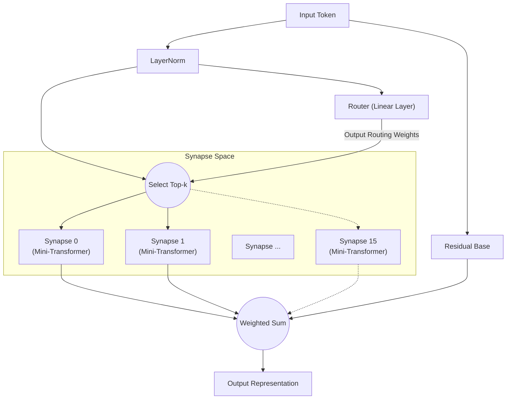

# All You Need Is Router: तंत्रिका नेटवर्क में गतिशील विरल मॉड्यूलरिटी

**Jun Suzuki**, स्वतंत्र शोधकर्ता

## Abstract
हाल के वर्षों में, डीप लर्निंग मॉडल तेजी से विशाल होते जा रहे हैं, जिससे प्रशिक्षण के लिए आवश्यक कम्प्यूटेशनल संसाधनों में विस्फोटक वृद्धि हो रही है। इसके अतिरिक्त, जब एक ही मोनोलिथिक नेटवर्क को विभिन्न विशेषताओं वाले कई कार्यों पर प्रशिक्षित किया जाता है, तो यह "विनाशकारी भुलक्कड़पन" (Catastrophic Forgetting) के प्रति अत्यधिक संवेदनशील होता है। इस समस्या के समाधान के रूप में, हम "Synaptic Routing Architecture (SRA)" प्रस्तावित करते हैं। हम प्रयोगात्मक रूप से प्रदर्शित करते हैं कि बिना किसी Attention तंत्र के एक अत्यंत सरल "एकल-परत राउटर" स्वायत्त रूप से कार्यों को कई सूक्ष्म मॉडलों (सिनैप्स) में वितरित कर सकता है, विनाशकारी भुलक्कड़पन को पूरी तरह से टाल सकता है। निष्कर्ष में, जटिल कार्यों को एक साथ सीखने के लिए वास्तव में जो आवश्यक था वह एक विशाल सघन Transformer नहीं, बल्कि एक "राउटर" था जो इनपुट के आधार पर उपयुक्त मॉड्यूल का चयन करता है।

## 1. Introduction
"Attention Is All You Need" की शुरुआत के बाद से, Transformer आर्किटेक्चर ने प्राकृतिक भाषा प्रसंस्करण से लेकर कंप्यूटर विज़न और रीइन्फोर्समेंट लर्निंग तक लगभग हर क्षेत्र पर प्रभुत्व स्थापित किया है। हालांकि, पैरामीटरों को सघन रूप से सक्रिय करने का पारंपरिक दृष्टिकोण मॉडल के स्केल होने पर कम्प्यूटेशनल लागत में घातीय वृद्धि का कारण बनता है।
हाल ही में, Mixtral जैसे मॉडलों द्वारा लोकप्रिय Mixture of Experts (MoE) ने महत्वपूर्ण ध्यान आकर्षित किया है। SRA इस MoE अवधारणा को और आगे बढ़ाता है, "सूक्ष्म कम्प्यूटेशनल इकाइयों (सिनैप्स)" और उन्हें "गतिशील रूप से संयोजित करने वाले हल्के राउटर" से बना नेटवर्क डिज़ाइन करता है। इस पेपर में, हम इस परिकल्पना को सत्यापित करते हैं कि "राउटर मल्टीटास्क लर्निंग में मॉडल का सच्चा मस्तिष्क है।"

## 2. Architecture (SRA)
SRA जैविक मस्तिष्क से प्रेरित एक गतिशील और विरल आर्किटेक्चर है। विशाल Transformer के बजाय, यह अत्यंत हल्के घटकों के संयोजन से बनाया गया है।

### 2.1 The Router (All You Need Is Router)
SRA का हृदय और मूल तत्व राउटर है। राउटर में स्वयं Attention जैसा कोई जटिल तंत्र नहीं है; इसका वास्तविक रूप **केवल एक एकल रैखिक परत** है।
राउटर इनपुट डेटा की छिपी अवस्था और प्रत्येक सिनैप्स के अद्वितीय "विशेषता वेक्टर (एम्बेडिंग)" के बीच डॉट प्रोडक्ट (कोसाइन समानता) की गणना करता है, जल्दी से उच्चतम स्कोर (सर्वश्रेष्ठ मिलान) वाले Top-k सिनैप्स निर्धारित करता है।

### 2.2 Tiny Synapses
प्रत्येक सिनैप्स एक छोटे Multi-Head Attention और MLP से बना स्वतंत्र, सूक्ष्म मॉड्यूल है। केवल राउटर द्वारा चयनित सिनैप्स ही गणना करते हैं, इसलिए SRA अत्यधिक उच्च कम्प्यूटेशनल दक्षता प्राप्त करता है।

### 2.3 Architecture Diagram
नीचे दिया गया आरेख उस प्रवाह को दर्शाता है जहां इनपुट का राउटर द्वारा मूल्यांकन किया जाता है और इष्टतम सिनैप्स की ओर रूट किया जाता है।

## 3. Experiment 1: Algorithmic Reasoning
यह सत्यापित करने के लिए कि राउटर विभिन्न कार्यों को स्वायत्त रूप से पहचान सकता है, हमने पूरी तरह से भिन्न विशेषताओं वाले चार एल्गोरिदमिक रीजनिंग कार्यों (`copy`, `reverse`, `paren`, `addmod`) पर एक ही SRA मॉडल को एक साथ प्रशिक्षित किया।

### परिणाम
10,000 स्टेप्स के संयुक्त प्रशिक्षण के बाद, मॉडल ने सभी कार्यों में **100% सटीकता (पूर्ण अनुमान)** प्राप्त की।
राउटर ने किस कार्य के लिए कौन से सिनैप्स का उपयोग किया (रूटिंग वितरण) निकालने और कार्यों के बीच कोसाइन समानता का विश्लेषण करने पर, उल्लेखनीय परिणाम प्राप्त हुए।

**राउटर द्वारा कार्य क्लस्टरिंग (गहरी परतों में):**
- **अनुक्रम हेरफेर समूह**: `COPY` और `REVERSE` (समानता 0.969)
- **गणना/तर्क समूह**: `PAREN` और `ADDMOD` (समानता 0.858)
- इन दो समूहों के बीच समानता 0.029 से 0.336 तक थी, स्पष्ट पृथक्करण दिखाते हुए।

बिना किसी मानवीय निर्देश के, राउटर ने स्वायत्त रूप से "अनुक्रम पुनर्व्यवस्थित करने वाले कार्यों" और "तर्क या गणना की आवश्यकता वाले कार्यों" के बीच अंतर किया।

## 4. Experiment 2: Cross-Domain Language Modeling
अगला, हमने "क्रॉस-डोमेन भाषा मॉडलिंग" का अधिक चुनौतीपूर्ण प्रयोग किया। `Code` (Python), `Math` (LaTeX), और `Text` (प्राकृतिक भाषा) — तीन पूरी तरह से अलग व्याकरण और शब्दावली वाले डोमेन पर एक साथ प्रशिक्षण दिया।

### परिणाम
केवल 1,000 स्टेप्स के प्रशिक्षण के बावजूद, मॉडल Python इंडेंटेशन, LaTeX विशेष संकेतन, और प्राकृतिक भाषा संदर्भ को पूरी तरह से अनुमान और उत्पन्न करने में सक्षम था।

प्रशिक्षण के अंत तक, राउटर ने "डोमेन-आधारित पृथक्करण" पूरा किया:
- `Code` प्रसंस्करण: **सिनैप्स 8** द्वारा प्रभावित
- `Math` प्रसंस्करण: **सिनैप्स 10 और 13** द्वारा
- `Text` प्रसंस्करण: **सिनैप्स 0 और 15** द्वारा

## 5. Experiment 3: Multilingual Machine Translation
भिन्न वाक्य रचनाओं वाली तीन भाषाओं (अंग्रेजी: SVO, फ्रेंच: SVO, जापानी: SOV) का उपयोग करके बहुभाषी मशीन अनुवाद का मल्टीटास्क लर्निंग किया गया। "फ्रेंच↔जापानी" जोड़ियों को जानबूझकर बाहर रखा गया।

### परिणाम
राउटर ने SVO और SOV के लिए स्वायत्त रूप से अलग-अलग सिनैप्स बनाए। ज़ीरो-शॉट अनुवाद में, मॉडल ने "अंग्रेजी" को पिवट भाषा के रूप में उपयोग करके फॉलबैक किया — यह सबूत है कि SRA क्रॉस-लिंगुअल सिमेंटिक स्पेस बनाता है।

## 6. Experiment 4: Decision Transformer (Offline RL)
"Treasure" और "Escape" दो अलग-अलग वातावरणों से ऑफलाइन RL डेटा पर प्रशिक्षित करने पर, **"अवधारणा" और "नीति" का पूर्ण पृथक्करण** देखा गया।
- **स्थिति टोकन**: सभी कार्यों में Expert 1 को रूट किए गए (साझा पर्यावरण मॉडल)
- **क्रिया टोकन**: कार्य-विशिष्ट नीति सिनैप्स को रूट किए गए

SRA ने स्वायत्त रूप से "एक ही आँखों से देखना, लेकिन अलग-अलग दिमागों से निर्णय लेना" — रीइन्फोर्समेंट लर्निंग के लिए आदर्श मॉड्यूलर संरचना प्राप्त की।

## 7. Conclusion
SRA के माध्यम से, "विशाल मॉडल के बैच कम्प्यूटेशन" से "सूक्ष्म मॉड्यूल के गतिशील चयन" की ओर प्रतिमान बदलाव की संभावना प्रदर्शित की गई। वास्तव में, **"All You Need Is Router."**

## Appendix: Interactive Demos

- **1. मूल संरचना और रूटिंग सत्यापन** 
  
- **2. एकल-कार्य लर्निंग और रूटिंग विशेषज्ञता** 
  
- **3. मल्टीटास्क लर्निंग और कार्य-विशिष्ट रूटिंग** 
  
- **4. Decision Transformer: अवधारणा और क्रिया का पृथक्करण** 
  
- **5. [अवश्य देखें] सिनैप्स लेज़न प्रयोग** 
  

## Appendix: Detailed Technical Reports

- **[SRA GPU Optimization & Benchmarking Report](./dev/SRA_GPU_Optimization_Report.md)**
- **[Multilingual Translation Routing Analysis](./dev/multilingual_translation_routing_analysis.md)**
- **[Decision Transformer Routing Analysis](./dev/decision_transformer_routing_analysis.md)**
