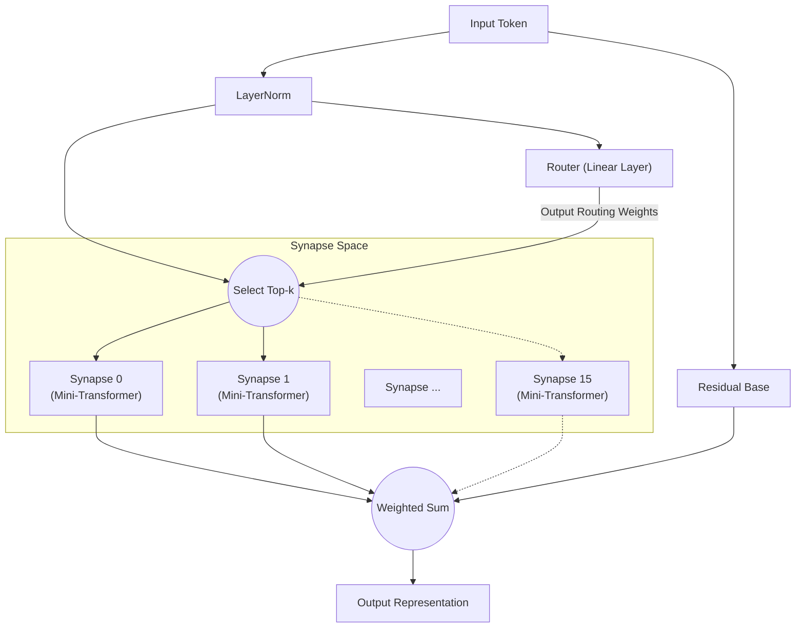

# All You Need Is Router: Modularità Dinamica e Sparsa nelle Reti Neurali

**Jun Suzuki**, Ricercatore Indipendente

## Abstract
Negli ultimi anni, i modelli di deep learning sono diventati sempre più massicci, portando a una crescita esplosiva delle risorse computazionali necessarie per l'addestramento. Inoltre, quando una singola rete monolitica viene addestrata su più compiti con caratteristiche diverse, è altamente suscettibile all'"oblio catastrofico" (Catastrophic Forgetting). Come soluzione a questo problema, proponiamo la "Synaptic Routing Architecture (SRA)". Dimostriamo sperimentalmente che un "router a singolo strato" estremamente semplice, privo di qualsiasi meccanismo di Attention, può distribuire autonomamente i compiti a molteplici modelli minuscoli (sinapsi), evitando completamente l'oblio catastrofico. In conclusione, ciò che era veramente necessario per apprendere simultaneamente compiti complessi non era un Transformer massiccio e denso, ma un "router" capace di selezionare i moduli appropriati in base all'input.

## 1. Introduction
Dall'introduzione di "Attention Is All You Need", l'architettura Transformer ha dominato quasi ogni dominio, dall'elaborazione del linguaggio naturale alla visione artificiale e all'apprendimento per rinforzo. Tuttavia, l'approccio convenzionale di attivazione densa dei parametri porta a un aumento esponenziale dei costi computazionali man mano che i modelli scalano.
Recentemente, il Mixture of Experts (MoE), reso popolare da modelli come Mixtral, ha guadagnato notevole attenzione. SRA spinge questo concetto MoE ancora oltre, progettando una rete composta da "unità di calcolo minuscole (sinapsi)" e un "router leggero che le combina dinamicamente". In questo articolo, verifichiamo l'ipotesi che "il Router è il vero cervello del modello nell'apprendimento multi-task".

## 2. Architecture (SRA)
SRA è un'architettura dinamica e sparsa ispirata al cervello biologico. Invece di un Transformer massiccio, è costruita da una combinazione di componenti estremamente leggeri.

### 2.1 The Router (All You Need Is Router)
Il cuore e la componente fondamentale di SRA è il Router. Il router stesso non possiede alcun meccanismo complesso come l'Attention; la sua vera forma è **semplicemente un singolo strato lineare**.
Il router calcola il prodotto scalare (similarità del coseno) tra lo stato nascosto dei dati di input e il "vettore di caratteristiche (embedding)" unico posseduto da ogni sinapsi, determinando rapidamente le Top-k sinapsi con i punteggi più alti (migliori corrispondenze).

### 2.2 Tiny Synapses
Ogni sinapsi è un modulo minuscolo indipendente composto da un piccolo strato Multi-Head Attention e un MLP. Poiché solo le sinapsi selezionate dal router eseguono calcoli, SRA raggiunge un'efficienza computazionale estremamente elevata.

### 2.3 Architecture Diagram
Il diagramma seguente illustra il flusso in cui un input viene valutato dal router e instradato verso le sinapsi ottimali.

## 3. Experiment 1: Algorithmic Reasoning
Per verificare se il router può distinguere autonomamente diversi compiti, abbiamo addestrato un singolo modello SRA simultaneamente su quattro compiti di ragionamento algoritmico con caratteristiche completamente diverse (`copy`, `reverse`, `paren`, `addmod`).

### Risultati
Dopo 10.000 passi di addestramento congiunto, il modello ha raggiunto un'**accuratezza del 100% (inferenza perfetta)** su tutti i compiti.
Inoltre, estraendo quali sinapsi il router ha utilizzato per quali compiti (la distribuzione di routing) e analizzando la similarità del coseno tra i compiti, abbiamo ottenuto risultati notevoli.

**Raggruppamento dei compiti da parte del Router (negli strati profondi):**
- **Gruppo di manipolazione delle sequenze**: `COPY` e `REVERSE` (similarità 0,969)
- **Gruppo calcolo/logica**: `PAREN` e `ADDMOD` (similarità 0,858)
- La similarità tra questi due gruppi variava da 0,029 a 0,336, mostrando una separazione netta.

Senza alcuna istruzione umana, il router ha distinto autonomamente tra "compiti che riordinano le sequenze" e "compiti che richiedono logica o calcolo". Ha condiviso dinamicamente le sinapsi per compiti simili separando esplicitamente i moduli instradando compiti completamente diversi verso sinapsi diverse.

## 4. Experiment 2: Cross-Domain Language Modeling
Successivamente, abbiamo condotto un esperimento molto più impegnativo di "modellazione del linguaggio cross-domain". Abbiamo addestrato simultaneamente il modello su tre domini con grammatiche e vocabolari completamente diversi: `Code` (Python), `Math` (LaTeX) e `Text` (linguaggio naturale).

### Risultati
Nonostante solo 1.000 passi di addestramento, il modello è stato in grado di inferire e generare perfettamente l'indentazione Python, la notazione speciale LaTeX e il contesto del linguaggio naturale.

**Evoluzione dell'uso delle sinapsi e specializzazione:**
Durante le fasi iniziali dell'addestramento (Warmup), tutte le sinapsi venivano utilizzate uniformemente. Tuttavia, verso la fine dell'addestramento, il router aveva completato una "segregazione per dominio" come segue:
- Elaborazione `Code`: dominata dalla **Sinapsi 8**
- Elaborazione `Math`: gestita dalle **Sinapsi 10 e 13**
- Elaborazione `Text`: gestita dalle **Sinapsi 0 e 15**

Anche in uno scenario in cui un modello monolitico soffrirebbe di oblio catastrofico, il router ha minimizzato con successo l'interferenza reciproca assegnando sinapsi specializzate (spazi di parametri indipendenti) a ciascun dominio.

## 5. Experiment 3: Multilingual Machine Translation
Per verificare ulteriormente la modularità nell'elaborazione del linguaggio naturale, abbiamo condotto un apprendimento multi-task per la traduzione automatica multilingue utilizzando tre lingue con strutture sintattiche diverse (inglese: SVO, francese: SVO, giapponese: SOV). Durante l'addestramento, le coppie "francese↔giapponese" sono state intenzionalmente escluse per testare la generalizzazione zero-shot.

### Risultati
**Divergenza autonoma del routing basata sulla struttura sintattica (SVO/SOV):**
L'analisi del tasso di utilizzo delle sinapsi ha rivelato la formazione autonoma di "sinapsi condivise SVO" che si attivano fortemente durante la traduzione tra inglese e francese (entrambi SVO), e "sinapsi specializzate SOV" il cui utilizzo aumenta solo durante la traduzione verso il giapponese (SOV). Questo indica che il router isola e acquisisce l'ordine delle parole e le regole sintattiche per ogni lingua come moduli distinti.

**Traduzione zero-shot e fallback sulla lingua pivot:**
Quando è stata richiesta la traduzione non vista "francese→giapponese", il modello ha esibito un comportamento altamente avanzato tipico dei modelli multilingue zero-shot: è ricaduto sulla produzione dell'"inglese", che aveva acquisito come rappresentazione latente comune (hub) per entrambe le lingue. Questa è la prova che SRA non memorizza semplicemente le coppie, ma costruisce uno spazio semantico translinguistico.

## 6. Experiment 4: Decision Transformer (Offline RL)
Infine, per dimostrare che SRA è applicabile a domini oltre il linguaggio naturale, l'abbiamo valutato come Decision Transformer addestrato su dati di traiettorie offline dell'apprendimento per rinforzo (RL). Il modello ha ricevuto registri di gioco (sequenze di stati, azioni e ricompense) da due ambienti con regole completamente diverse: un compito "Treasure" (navigare verso un obiettivo) e un compito "Escape" (fuggire da un nemico).

### Risultati
La visualizzazione del routing token per token ha rivelato un fenomeno sorprendente: **la separazione completa di "Percezione" e "Policy"**.
- **Token di stato:** Quando venivano immessi token che indicavano le coordinate dell'agente, il router **li instradava invariabilmente verso una sinapsi specifica (Expert 1)**, indipendentemente dal tipo di compito. Questo mostra che il modello ambientale per la "percezione spaziale" è perfettamente condiviso tra i compiti.
- **Token di azione:** Tuttavia, nei passi per la generazione dell'azione successiva (es. UP/LEFT), il router divergeva chiaramente, instradando verso una sinapsi di policy per Treasure o una diversa sinapsi di policy per Escape.

Senza alcun design umano, SRA ha acquisito autonomamente la struttura modulare ideale per l'apprendimento per rinforzo: "Percepire l'ambiente con gli stessi occhi, ma prendere decisioni con cervelli diversi."

## 7. Conclusion
Attraverso la Synaptic Routing Architecture (SRA), questo articolo ha dimostrato il potenziale per un cambio di paradigma dal "calcolo batch con un modello massiccio" alla "selezione dinamica di moduli minuscoli".
Come evidenziato dai diversi risultati sperimentali nel ragionamento algoritmico, nella modellazione del linguaggio cross-domain, nella traduzione automatica multilingue e nell'apprendimento per rinforzo basato su Decision Transformer, ciò che è veramente necessario per prevenire l'interferenza multi-task, isolare logiche e policy specifiche per compito e condividere spazi di percezione e latenti comuni, non è il gigantismo di meccanismi di Attention complessi, ma la presenza di un "Router" semplice e intelligente. In effetti, **"All You Need Is Router."**

## Appendix: Interactive Demos

Abbiamo preparato demo Jupyter Notebook dove potete eseguire e sperimentare interattivamente l'architettura SRA e i risultati sperimentali discussi in questo articolo direttamente nel vostro browser. Provateli aprendo Google Colab dai badge sottostanti.

- **1. Struttura di base e validazione del routing** 
  
- **2. Apprendimento single-task e specializzazione del routing** 
  
- **3. Apprendimento multi-task e routing specifico per compito** 
  
- **4. Decision Transformer: separazione di percezione e azione** 
  
- **5. [Da non perdere] Esperimento di lesione sinaptica** 
  

## Appendix: Detailed Technical Reports

Per dati grezzi più dettagliati, log e il processo di progettazione architettonica riguardanti gli esperimenti in questo articolo, consultate i seguenti rapporti tecnici (Markdown) nel repository.

- **[SRA GPU Optimization & Benchmarking Report](./dev/SRA_GPU_Optimization_Report.md)**
  - Confronto delle prestazioni (velocità di addestramento, consumo VRAM, progressione dell'accuratezza) tra baseline (Transformer/MLP) e SRA, insieme ai risultati di validazione di tre diversi approcci di implementazione SRA (Batched/MoE/Seq).
- **[Multilingual Translation Routing Analysis](./dev/multilingual_translation_routing_analysis.md)**
  - Analisi della biforcazione sinaptica autonoma basata sulle strutture sintattiche SVO/SOV nella traduzione automatica multilingue (inglese, francese, giapponese) e del comportamento di routing durante la traduzione zero-shot.
- **[Decision Transformer Routing Analysis](./dev/decision_transformer_routing_analysis.md)**
  - Analisi dell'apprendimento per rinforzo offline nei compiti GridWorld. Dettagli sulla separazione delle sinapsi di policy per compito e la separazione di percezione e azione basata sui token "Stato, Ricompensa e Azione".
