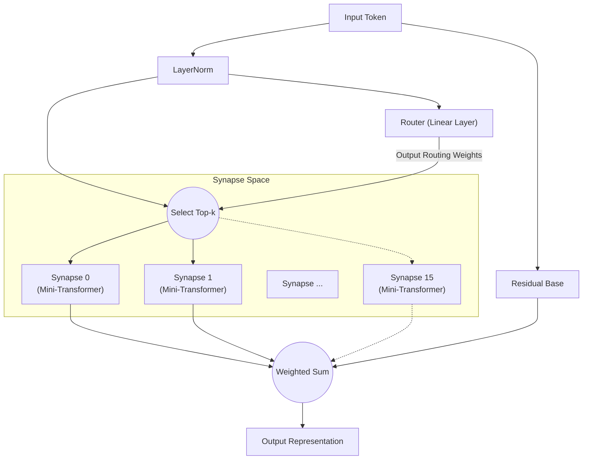

# All You Need Is Router: 신경망에서의 동적 희소 모듈화

**Jun Suzuki**, 독립 연구자

## Abstract
최근 딥러닝 모델은 점점 더 거대해지고 있으며, 학습에 필요한 계산 자원은 폭발적으로 증가하고 있습니다. 또한 단일 모놀리식 네트워크로 서로 다른 특성을 가진 여러 태스크를 학습시키면 "파국적 망각(Catastrophic Forgetting)"이 발생하기 쉽다는 문제도 있습니다. 본 논문에서는 이 문제의 해결책으로 "Synaptic Routing Architecture (SRA)"를 제안합니다. Attention 메커니즘이 전혀 없는 극히 단순한 "단일 레이어 라우터(Router)"가 자율적으로 여러 초소형 모델(시냅스)에 태스크를 분배하여 파국적 망각을 완전히 회피할 수 있음을 실험적으로 증명합니다. 결론적으로, 복잡한 태스크를 동시에 학습하는 데 정말로 필요했던 것은 거대하고 밀집된 Transformer가 아니라, 입력에 따라 적절한 모듈을 선택하는 "라우터"였습니다.

## 1. Introduction
"Attention Is All You Need"의 등장 이후, Transformer 아키텍처는 자연어 처리부터 컴퓨터 비전, 강화 학습에 이르기까지 거의 모든 분야를 지배해 왔습니다. 그러나 파라미터를 밀집(Dense)하게 활성화하는 기존 접근 방식은 모델이 확장됨에 따라 계산 비용이 기하급수적으로 증가합니다.
최근 Mixtral 등으로 대표되는 MoE(Mixture of Experts)가 큰 주목을 받고 있습니다. SRA는 이 MoE 개념을 더욱 발전시켜, "초소형 계산 유닛(시냅스)"과 "이들을 동적으로 결합하는 경량 라우터"로 구성된 네트워크를 설계했습니다. 본 논문에서는 "라우터야말로 멀티태스크 학습에서 모델의 두뇌"라는 가설을 검증합니다.

## 2. Architecture (SRA)
SRA는 생물학적 뇌에서 영감을 받은 동적이고 희소한(Sparse) 아키텍처입니다. 거대한 Transformer 대신, 극히 경량인 컴포넌트의 조합으로 구축됩니다.

### 2.1 The Router (All You Need Is Router)
SRA의 심장부이자 핵심이 되는 것은 라우터입니다. 라우터 자체는 Attention 등의 복잡한 메커니즘을 전혀 갖지 않으며, 실체는 **단순한 1층의 선형 레이어(Linear Layer)**입니다.
라우터는 입력 데이터의 은닉 상태와 각 시냅스가 보유한 "특징 벡터(임베딩)" 간의 내적(코사인 유사도)을 계산하여, 가장 점수가 높은(가장 잘 일치하는) Top-k개의 시냅스를 빠르게 결정합니다.

### 2.2 Tiny Synapses
각 시냅스는 소형 Multi-Head Attention과 MLP로 구성된 독립적인 초소형 모듈입니다. 라우터에 의해 선택된 시냅스만 계산을 수행하므로, 매우 높은 계산 효율을 달성합니다.

### 2.3 Architecture Diagram
아래 다이어그램은 입력이 라우터에 의해 평가되고 최적의 시냅스로 라우팅되는 흐름을 보여줍니다.

## 3. Experiment 1: Algorithmic Reasoning
라우터가 서로 다른 태스크를 자율적으로 구분할 수 있는지 검증하기 위해, 특성이 완전히 다른 4가지 알고리즘적 추론 태스크(`copy`, `reverse`, `paren`, `addmod`)를 하나의 SRA 모델에 동시에 학습시켰습니다.

### 결과
10,000 스텝의 공동 학습 결과, 모든 태스크에서 **정확도 100%(완벽한 추론)**를 달성했습니다.
또한, 라우터가 어떤 태스크에서 어떤 시냅스를 사용했는지(라우팅 분포)를 추출하고 태스크 간 코사인 유사도를 분석한 결과, 놀라운 결과를 얻었습니다.

**라우터에 의한 태스크 클러스터링 (깊은 레이어에서):**
- **시퀀스 조작 그룹**: `COPY`와 `REVERSE` (유사도 0.969)
- **계산/논리 그룹**: `PAREN`과 `ADDMOD` (유사도 0.858)
- 위 두 그룹 간의 유사도는 0.029 ~ 0.336으로 명확하게 분리됨.

인간이 어떠한 지시도 주지 않았음에도 라우터는 "시퀀스의 순서를 바꾸는 태스크"와 "논리나 계산이 필요한 태스크"를 **자율적으로 식별하여, 유사한 태스크에는 시냅스를 공유하고, 서로 다른 태스크에는 명확히 다른 시냅스를 사용하도록 모듈을 분리**했습니다.

## 4. Experiment 2: Cross-Domain Language Modeling
다음으로, 훨씬 더 난이도가 높은 "이종 도메인 언어 모델링"을 실시했습니다. 문법과 어휘가 완전히 다른 `Code` (Python), `Math` (LaTeX), `Text` (자연어)의 3개 도메인을 동시에 학습시켰습니다.

### 결과
불과 1,000 스텝의 학습에도 불구하고, Python의 인덴테이션, LaTeX의 특수 표기법, 자연어의 문맥을 완벽하게 추론·생성할 수 있었습니다.

**시냅스 사용 빈도의 추이와 전문화:**
학습 초기(Warmup 시)에는 모든 시냅스가 균등하게 사용되었지만, 학습 후반에는 라우터가 다음과 같은 "도메인별 구분"을 완료했습니다:
- `Code` 처리: **시냅스 8**이 지배적
- `Math` 처리: **시냅스 10과 13**이 담당
- `Text` 처리: **시냅스 0과 15**가 담당

모놀리식 모델에서라면 파국적 망각이 발생했을 상황에서도, 라우터가 도메인마다 전문 시냅스(독립적인 파라미터 공간)를 할당하여 상호 간섭을 최소화하는 데 성공했습니다.

## 5. Experiment 3: Multilingual Machine Translation
자연어 처리에서의 모듈성을 더욱 검증하기 위해, 구문 구조가 다른 3개 언어(영어:SVO, 프랑스어:SVO, 일본어:SOV)를 사용한 다국어 기계 번역의 멀티태스크 학습을 수행했습니다. 학습 시에는 제로샷 검증을 위해 "프랑스어↔일본어" 쌍을 의도적으로 제외했습니다.

### 결과
**구문 구조(SVO/SOV)에 기반한 자율적 라우팅 분기:**
시냅스 사용률을 분석한 결과, 영불 간(SVO끼리) 번역 시 높은 빈도로 활성화되는 "SVO 공유 시냅스"와, 일본어(SOV)로의 번역 시에만 사용률이 급증하는 "SOV 특화 시냅스"가 자율적으로 형성되었습니다. 이는 라우터가 언어별 어순과 구문 규칙을 구별된 모듈로 분리·획득하고 있음을 보여줍니다.

**제로샷 번역에서의 피벗 언어 폴백:**
학습하지 않은 "프랑스어→일본어" 번역을 요청했을 때, 모델은 양쪽 언어의 공통 잠재 표현(허브)으로 획득한 "영어"를 출력하여 폴백하는, 제로샷 다국어 모델 특유의 고도로 정교한 행동을 재현했습니다. 이는 SRA가 단순한 쌍의 암기가 아니라 교차 언어적 의미 공간을 구축하고 있다는 증거입니다.

## 6. Experiment 4: Decision Transformer (Offline RL)
마지막으로, SRA가 자연어 이외의 도메인에도 적용 가능함을 보여주기 위해, 강화 학습(RL)의 오프라인 궤적 데이터를 학습시키는 Decision Transformer로서의 검증을 수행했습니다. 규칙이 완전히 다른 2개의 환경(목표를 향해 나아가는 "Treasure" 태스크와 적으로부터 도망치는 "Escape" 태스크)의 플레이 로그(상태, 행동, 보상의 시퀀스)를 입력으로 제공했습니다.

### 결과
토큰별 라우팅을 시각화한 결과, **"지각(Perception)"과 "정책(Policy)"의 완전한 분리**라는 경이적인 현상이 확인되었습니다.
- **상태(State) 토큰**: 에이전트 자신의 좌표를 나타내는 토큰이 입력되면, 라우터는 태스크 유형에 관계없이 **예외 없이 특정 시냅스(Expert 1)로 라우팅**했습니다. 이는 "공간 지각"을 위한 환경 모델이 태스크 간에 완전히 공유되고 있음을 보여줍니다.
- **행동(Action) 토큰**: 그러나 다음 행동(UP/LEFT 등)을 생성하는 단계에서는, 라우터가 Treasure용 정책 시냅스와 Escape용 정책 시냅스로 명확하게 라우팅을 분기시켰습니다.

인간의 설계 없이도 SRA는 강화 학습에서의 이상적인 모듈 구조——"같은 눈으로 환경을 지각하되, 서로 다른 뇌로 판단을 내리는" 구조——를 자율적으로 획득했습니다.

## 7. Conclusion
본 논문에서는 Synaptic Routing Architecture (SRA)를 통해 "거대한 모델의 일괄 계산"에서 "초소형 모듈의 동적 선택"으로의 패러다임 전환 가능성을 보여주었습니다.
알고리즘적 추론, 이종 도메인 언어 모델링, 다국어 기계 번역, Decision Transformer 기반 강화 학습이라는 다양한 실험 결과가 보여주듯이, 멀티태스크 간섭을 방지하고, 태스크별 로직과 정책을 분리하면서도, 공통된 지각과 잠재 공간을 공유하기 위해 정말로 필요한 것은 복잡한 Attention 메커니즘의 거대화가 아니라, 단순하고 지적인 "라우터"의 존재였습니다. 바로, **"All You Need Is Router"**입니다.

## Appendix: Interactive Demos

본 논문에서 해설한 SRA의 아키텍처와 실험 결과를 브라우저에서 직접 실행하며 체험할 수 있는 Jupyter Notebook 데모를 준비했습니다. 아래 배지를 클릭하여 Google Colab을 열고 자유롭게 시도해 보세요.

- **1. 기본 구조 및 라우팅 검증** 
  
- **2. 싱글 태스크 학습과 라우팅 특화** 
  
- **3. 멀티태스크 학습과 태스크별 사용 분리** 
  
- **4. Decision Transformer: 지각과 행동의 분리** 
  
- **5. 【필독】시냅스 손상(Lesion) 실험** 
  

## Appendix: Detailed Technical Reports

본 논문의 각 실험에 대한 보다 상세한 원시 데이터, 로그, 아키텍처 설계 과정은 리포지토리 내의 다음 기술 보고서(Markdown)를 참조해 주세요.

- **[SRA GPU Optimization & Benchmarking Report](./dev/SRA_GPU_Optimization_Report.md)**
  - 베이스라인(Transformer/MLP)과 SRA의 성능 비교(학습 속도, VRAM 소비, 정확도 추이) 및 3가지 SRA 구현 접근법(Batched/MoE/Seq)의 검증 결과.
- **[Multilingual Translation Routing Analysis](./dev/multilingual_translation_routing_analysis.md)**
  - 다국어 기계 번역(영어·프랑스어·일본어)에서의 SVO/SOV 구문에 따른 시냅스의 자율적 분기 및 제로샷 번역 시의 라우팅 행동 분석.
- **[Decision Transformer Routing Analysis](./dev/decision_transformer_routing_analysis.md)**
  - GridWorld 태스크에서의 오프라인 강화 학습 분석. 태스크별 정책 시냅스의 분리와 "상태·보상·행동" 토큰에 따른 지각과 행동의 분리 현상.
