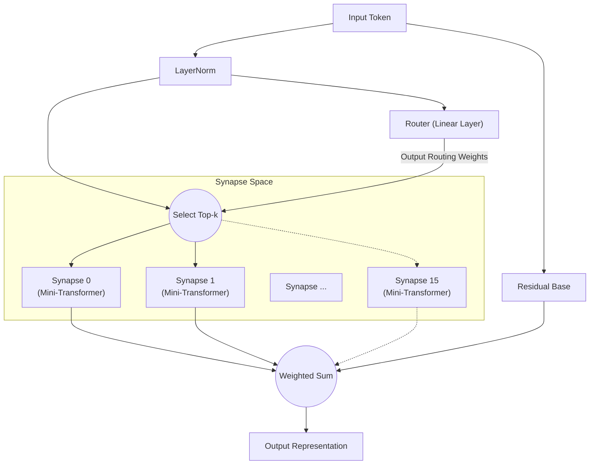

# All You Need Is Router: Dynamic Sparse Modularity in Neural Networks

**Jun Suzuki**, Independent Researcher

## Abstract
近年、深層学習モデルは巨大化の一途を辿り、学習に必要な計算リソースは爆発的に増加しています。また、単一の巨大なネットワーク（モノリシック・モデル）で性質の異なる複数のタスクを学習させると「破局的忘却（Catastrophic Forgetting）」が生じやすいという問題もあります。本稿では、この問題に対する解として「Synaptic Routing Architecture (SRA)」を提案し、Attentionを持たない極めてシンプルな「単層のルーター（Router）」が、自律的に複数の極小モデル（シナプス）へタスクを振り分け、破局的忘却を完全に回避できることを実験的に証明します。結論として、複雑なタスクを同時に学習する上で本当に必要だったのは、巨大で密なTransformerではなく、入力に応じて適切なモジュールを選択する「ルーター」でした。

## 1. Introduction
「Attention Is All You Need」の登場以降、Transformerアーキテクチャは自然言語処理から画像認識、強化学習に至るまであらゆるドメインを席巻しました。しかし、パラメータを密（Dense）に活性化させる従来のアプローチでは、スケールアップに伴う計算コストが指数関数的に増大します。
近年、Mixtral などに代表される MoE (Mixture of Experts) が注目を集めていますが、SRA はこの MoE の概念をさらに推し進め、「極小の計算ユニット（シナプス）」と「それらを動的に組み合わせる軽量なルーター」によって構成されるネットワークを設計しました。本稿では、「Routerこそがマルチタスク学習におけるモデルの頭脳である」という仮説を検証します。

## 2. Architecture (SRA)
SRAは生物の脳を模倣した動的でスパース（疎）なアーキテクチャです。巨大なTransformerの代わりに、非常に軽量なコンポーネントの組み合わせで構築されています。

### 2.1 The Router (All You Need Is Router)
SRAの心臓部であり、「肝」となるのがルーターです。ルーター自体はAttentionなどの複雑な機構を一切持たず、実体は**単なる1層の線形層（Linear層）**です。
ルーターは入力されたデータの隠れ状態と、各シナプスが持つ「特徴ベクトル（埋め込み）」との内積（コサイン類似度）を計算し、最もスコアが高い（合致する） Top-k 個のシナプスを素早く判定します。

### 2.2 Tiny Synapses
各シナプスは、小型のMulti-Head AttentionとMLPからなる独立した極小モジュールです。ルーターによって選ばれたシナプスのみが計算を実行するため、非常に高い計算効率を誇ります。

### 2.3 Architecture Diagram
以下の図は、入力がルーターによって評価され、最適なシナプスにルーティングされる流れを示しています。

## 3. Experiment 1: Algorithmic Reasoning
ルーターが異なるタスクを自律的に見分けられるかを検証するため、性質の全く異なる4つのアルゴリズム的推論タスク（`copy`, `reverse`, `paren`, `addmod`）を1つのSRAモデルに同時に学習させました。

### 結果
10,000ステップの同時学習の結果、すべてのタスクにおいて**Accuracy 100%（完全な推論）**を達成しました。
さらに、ルーターがどのタスクでどのシナプスを使ったのか（ルーティング分布）を抽出し、タスク間のコサイン類似度を分析したところ、驚くべき結果が得られました。

**ルーターによるタスクのクラスタリング（深いレイヤー）:**
- **系列操作グループ**: `COPY` と `REVERSE` （類似度 0.969）
- **計算/論理グループ**: `PAREN` と `ADDMOD` （類似度 0.858）
- 上記2グループ間の類似度は 0.029 〜 0.336 と明確に分離。

人間が一切の指示を与えなくとも、ルーターは「系列の順番を入れ替えるタスク」と「ロジックや計算を要するタスク」を**自律的に見抜き、似たタスクではシナプスを共有し、異なるタスクでは明確に別のシナプスを使うようにモジュールを分離**していました。

## 4. Experiment 2: Cross-Domain Language Modeling
次に、さらに難易度の高い「異種ドメイン言語モデリング」を実施しました。文法や語彙が全く異なる `Code` (Python)、`Math` (LaTeX)、`Text` (自然言語) の3ドメインを同時に学習させました。

### 結果
わずか1000ステップの学習にもかかわらず、Pythonのインデント、LaTeXの特殊記法、自然言語の文脈を完璧に推論・生成することができました。

**シナプスの使用頻度の推移と専門化:**
学習初期（Warmup時）には全シナプスが均等に使われていましたが、学習終盤においてルーターは以下のような「ドメインごとの棲み分け」を完了させました。
- `Code` の処理: **シナプス 8** が支配的
- `Math` の処理: **シナプス 10 と 13** が担当
- `Text` の処理: **シナプス 0 と 15** が担当

モノリシックなモデルであれば破局的忘却が起きてしまうような状況でも、ルーターがドメインごとに専門のシナプス（独立したパラメータ空間）を割り当てたことで、相互の干渉を最小限に抑えることに成功しました。

## 5. Experiment 3: Multilingual Machine Translation
自然言語処理におけるモジュール性をさらに検証するため、構文構造の異なる3言語（英語:SVO、フランス語:SVO、日本語:SOV）を用いた多言語機械翻訳のマルチタスク学習を行いました。学習時にはゼロショット検証のため「フランス語↔日本語」のペアを意図的に除外しています。

### 結果と考察
**構文構造（SVO/SOV）による自律的なルーティングの分岐:**
シナプス使用率を分析したところ、英仏間（SVO同士）の翻訳時に高頻度で活性化する「SVO共有シナプス」と、日本語（SOV）への翻訳時にのみ使用率が跳ね上がる「SOV特化シナプス」が自律的に形成されていました。これは、ルーターが言語ごとの語順や構文ルールをモジュールとして分離・獲得していることを示しています。

**ゼロショット翻訳におけるピボット言語へのフォールバック:**
学習していない「フランス語→日本語」の翻訳を要求した結果、モデルは両言語の共通の潜在表現（ハブ）として獲得していた「英語」を出力してフォールバックするという、ゼロショット多言語モデル特有の極めて高度な振る舞いを再現しました。SRAが単なるペアの暗記ではなく、言語横断的な意味空間を構築している証左です。

## 6. Experiment 4: Decision Transformer (Offline RL)
最後に、SRAが自然言語以外のドメインにも適用可能かを示すため、強化学習（RL）のオフライン軌跡データを学習させる Decision Transformer としての検証を行いました。ルールが全く異なる2つの環境（目標を目指す「Treasure」タスクと、敵から逃げる「Escape」タスク）のプレイログ（状態・行動・報酬の系列）を入力として与えました。

### 結果と考察
1トークンごとのルーティングを可視化した結果、**「知覚（Perception）」と「方策（Policy）」の完全な分離**という驚異的な現象が確認されました。
- **状態（State）トークン**: 自身の座標を示すトークンが入力された際、ルーターはタスクの種類にかかわらず**例外なく特定のシナプス（Expert 1）にルーティング**しました。これは「空間の知覚」という環境モデルがタスク間で完全に共有されていることを示します。
- **行動（Action）トークン**: 次の行動（UP/LEFTなど）を生成するステップになると、ルーターはTreasure用の方策シナプスと、Escape用の方策シナプスへとルーティングを明確に分岐させました。

SRAは、「同じ目で環境を知覚し、異なる脳で判断を下す」という強化学習における理想的なモジュール構造を、人間の設計なしに自律的に獲得したのです。

## 7. Conclusion
本稿では、Synaptic Routing Architecture (SRA) を通じて、「巨大なモデルの一括計算」から「極小モジュールの動的選択」へのパラダイムシフトの可能性を示しました。
アルゴリズム的推論、異種ドメイン言語モデリング、多言語機械翻訳、そしてDecision Transformerによる強化学習という多岐にわたる実験結果が示す通り、複数タスクの干渉を防ぎ、タスク特有のロジックや方策を分離しつつ、共通の知覚や潜在空間を共有するために本当に必要なのは、複雑なAttention機構の巨大化ではなく、シンプルで賢い「ルーター」の存在でした。まさに、**"All You Need Is Router"** なのです。
