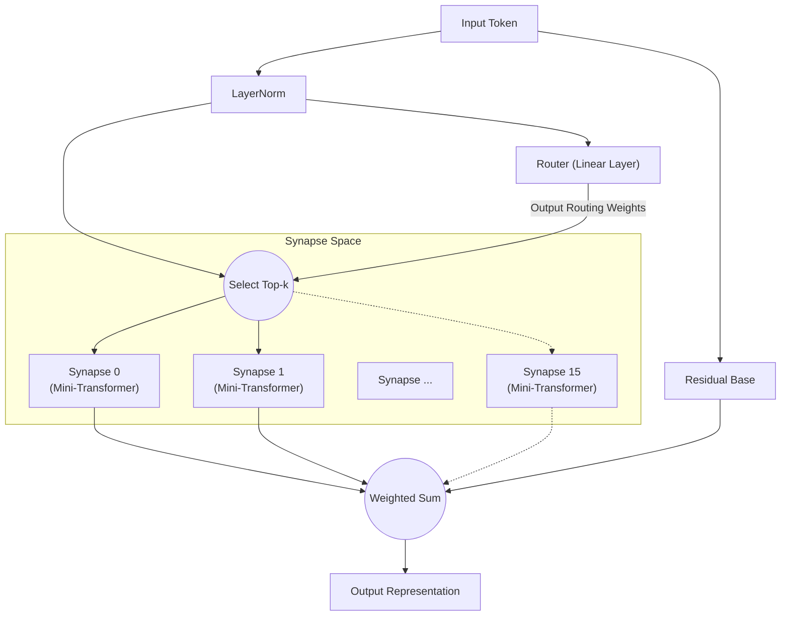

# All You Need Is Router: Dynamic Sparse Modularity in Neural Networks

**Jun Suzuki**, Independent Researcher

## Abstract
In recent years, deep learning models have become increasingly massive, leading to an explosive growth in the computational resources required for training. Furthermore, when training a single monolithic network on multiple tasks with different characteristics, it is highly susceptible to "catastrophic forgetting." As a solution to this problem, we propose the "Synaptic Routing Architecture (SRA)." We experimentally demonstrate that an extremely simple "single-layer router" without any Attention mechanism can autonomously route tasks to multiple tiny models (synapses), completely avoiding catastrophic forgetting. In conclusion, what was truly needed to learn complex tasks simultaneously was not a massive dense Transformer, but a "router" that selects appropriate modules based on the input.

## 1. Introduction
Since the introduction of "Attention Is All You Need," the Transformer architecture has dominated almost every domain, from natural language processing to computer vision and reinforcement learning. However, the conventional approach of densely activating parameters leads to an exponential increase in computational costs as models scale up.
Recently, Mixture of Experts (MoE), as popularized by models like Mixtral, has gained significant attention. SRA pushes this MoE concept even further by designing a network composed of "tiny computational units (synapses)" and a "lightweight router that dynamically combines them." In this paper, we verify the hypothesis that "the Router is the true brain of the model in multitask learning."

## 2. Architecture (SRA)
SRA is a dynamic and sparse architecture inspired by the biological brain. Instead of a massive Transformer, it is built from a combination of extremely lightweight components.

### 2.1 The Router (All You Need Is Router)
The heart and "core" of SRA is the Router. The router itself lacks any complex mechanisms such as Attention; its true form is **merely a single linear layer**.
The router calculates the dot product (cosine similarity) between the hidden state of the input data and the unique "feature vector (embedding)" possessed by each synapse, quickly determining the Top-k synapses with the highest scores (best matches).

### 2.2 Tiny Synapses
Each synapse is an independent, tiny module consisting of a small Multi-Head Attention layer and an MLP. Because computations are executed only by the synapses selected by the router, SRA achieves extremely high computational efficiency.

### 2.3 Architecture Diagram
The diagram below illustrates the flow where an input is evaluated by the router and routed to the optimal synapses.

## 3. Experiment 1: Algorithmic Reasoning
To verify whether the router can autonomously distinguish between different tasks, we trained a single SRA model simultaneously on four algorithmic reasoning tasks with entirely different characteristics (`copy`, `reverse`, `paren`, `addmod`).

### Results
After 10,000 steps of joint training, the model achieved **100% Accuracy (perfect inference)** across all tasks.
Furthermore, by extracting which synapses the router used for which tasks (the routing distribution) and analyzing the cosine similarity between tasks, we obtained striking results.

**Task Clustering by the Router (in deep layers):**
- **Sequence Manipulation Group**: `COPY` and `REVERSE` (Similarity 0.969)
- **Computation / Logic Group**: `PAREN` and `ADDMOD` (Similarity 0.858)
- The similarity between these two groups ranged from 0.029 to 0.336, showing a clear separation.

Without any human instructions, the router autonomously distinguished between "tasks that reorder sequences" and "tasks requiring logic or computation." It dynamically shared synapses for similar tasks while explicitly separating modules by routing completely different tasks to different synapses.

## 4. Experiment 2: Cross-Domain Language Modeling
Next, we conducted a much more challenging "cross-domain language modeling" experiment. We simultaneously trained the model on three domains with entirely different grammars and vocabularies: `Code` (Python), `Math` (LaTeX), and `Text` (Natural Language).

### Results
Despite training for only 1,000 steps, the model was able to perfectly infer and generate Python indentation, special LaTeX notation, and natural language context.

**Evolution of Synapse Usage and Specialization:**
During the early stages of training (Warmup), all synapses were used uniformly. However, towards the end of training, the router had completed a "domain-based segregation" as follows:
- `Code` processing: Dominated by **Synapse 8**
- `Math` processing: Handled by **Synapses 10 and 13**
- `Text` processing: Handled by **Synapses 0 and 15**

Even in a scenario where a monolithic model would suffer from catastrophic forgetting, the router successfully minimized mutual interference by allocating specialized synapses (independent parameter spaces) to each domain.

## 5. Conclusion
Through the Synaptic Routing Architecture (SRA), this paper demonstrated the potential for a paradigm shift from "batch computation using a massive model" to the "dynamic selection of tiny modules."
As evidenced by the results of our algorithmic reasoning and cross-domain language modeling experiments, what is truly needed to prevent multi-task interference and achieve both high generalization and learning efficiency is not the gigantism of complex Attention mechanisms, but the presence of a simple and intelligent "Router." Indeed, **"All You Need Is Router."**
