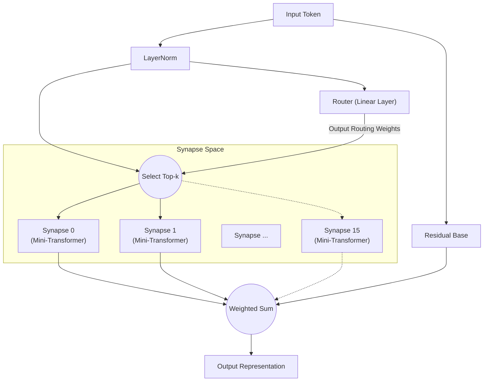

# All You Need Is Router: Modularidade Dinâmica e Esparsa em Redes Neurais

**Jun Suzuki**, Pesquisador Independente

## Abstract
Nos últimos anos, os modelos de aprendizado profundo tornaram-se cada vez mais massivos, levando a um crescimento explosivo dos recursos computacionais necessários para o treinamento. Além disso, quando uma única rede monolítica é treinada em múltiplas tarefas com características diferentes, ela é altamente suscetível ao "esquecimento catastrófico" (Catastrophic Forgetting). Como solução para este problema, propomos a "Synaptic Routing Architecture (SRA)". Demonstramos experimentalmente que um "roteador de camada única" extremamente simples, sem qualquer mecanismo de Attention, pode distribuir autonomamente tarefas a múltiplos modelos diminutos (sinapses), evitando completamente o esquecimento catastrófico. Em conclusão, o que era verdadeiramente necessário para aprender tarefas complexas simultaneamente não era um Transformer massivo e denso, mas um "roteador" que seleciona os módulos apropriados com base na entrada.

## 1. Introduction
Desde a introdução do "Attention Is All You Need", a arquitetura Transformer dominou quase todos os domínios, do processamento de linguagem natural à visão computacional e aprendizado por reforço. No entanto, a abordagem convencional de ativação densa de parâmetros leva a um aumento exponencial dos custos computacionais à medida que os modelos escalam.
Recentemente, o Mixture of Experts (MoE), popularizado por modelos como o Mixtral, ganhou atenção significativa. O SRA leva este conceito de MoE ainda mais longe, projetando uma rede composta por "unidades de computação diminutas (sinapses)" e um "roteador leve que as combina dinamicamente". Neste artigo, verificamos a hipótese de que "o Roteador é o verdadeiro cérebro do modelo no aprendizado multitarefa".

## 2. Architecture (SRA)
O SRA é uma arquitetura dinâmica e esparsa inspirada no cérebro biológico. Em vez de um Transformer massivo, é construído a partir de uma combinação de componentes extremamente leves.

### 2.1 The Router (All You Need Is Router)
O coração e o componente fundamental do SRA é o Roteador. O roteador em si não possui nenhum mecanismo complexo como Attention; sua verdadeira forma é **simplesmente uma única camada linear**.
O roteador calcula o produto escalar (similaridade do cosseno) entre o estado oculto dos dados de entrada e o "vetor de características (embedding)" único de cada sinapse, determinando rapidamente as Top-k sinapses com as pontuações mais altas (melhores correspondências).

### 2.2 Tiny Synapses
Cada sinapse é um módulo diminuto independente composto por uma pequena camada Multi-Head Attention e um MLP. Como apenas as sinapses selecionadas pelo roteador executam cálculos, o SRA atinge eficiência computacional extremamente alta.

### 2.3 Architecture Diagram
O diagrama abaixo ilustra o fluxo onde uma entrada é avaliada pelo roteador e roteada para as sinapses ótimas.

## 3. Experiment 1: Algorithmic Reasoning
Para verificar se o roteador pode distinguir autonomamente diferentes tarefas, treinamos um único modelo SRA simultaneamente em quatro tarefas de raciocínio algorítmico com características completamente diferentes (`copy`, `reverse`, `paren`, `addmod`).

### Resultados
Após 10.000 passos de treinamento conjunto, o modelo alcançou **100% de acurácia (inferência perfeita)** em todas as tarefas.
Além disso, ao extrair quais sinapses o roteador utilizou para cada tarefa (a distribuição de roteamento) e analisar a similaridade do cosseno entre as tarefas, obtivemos resultados notáveis.

**Agrupamento de tarefas pelo Roteador (em camadas profundas):**
- **Grupo de manipulação de sequências**: `COPY` e `REVERSE` (similaridade 0,969)
- **Grupo de cálculo/lógica**: `PAREN` e `ADDMOD` (similaridade 0,858)
- A similaridade entre estes dois grupos variou de 0,029 a 0,336, mostrando uma separação clara.

Sem qualquer instrução humana, o roteador distinguiu autonomamente entre "tarefas que reordenam sequências" e "tarefas que requerem lógica ou cálculo". Ele compartilhou dinamicamente sinapses para tarefas semelhantes enquanto separou explicitamente os módulos roteando tarefas completamente diferentes para sinapses diferentes.

## 4. Experiment 2: Cross-Domain Language Modeling
Em seguida, conduzimos um experimento muito mais desafiador de "modelagem de linguagem entre domínios". Treinamos simultaneamente o modelo em três domínios com gramáticas e vocabulários completamente diferentes: `Code` (Python), `Math` (LaTeX) e `Text` (linguagem natural).

### Resultados
Apesar de apenas 1.000 passos de treinamento, o modelo foi capaz de inferir e gerar perfeitamente a indentação Python, a notação especial LaTeX e o contexto de linguagem natural.

**Evolução do uso de sinapses e especialização:**
Durante as fases iniciais do treinamento (Warmup), todas as sinapses foram utilizadas uniformemente. No entanto, no final do treinamento, o roteador completou uma "segregação por domínio" da seguinte forma:
- Processamento `Code`: dominado pela **Sinapse 8**
- Processamento `Math`: gerenciado pelas **Sinapses 10 e 13**
- Processamento `Text`: gerenciado pelas **Sinapses 0 e 15**

Mesmo em um cenário onde um modelo monolítico sofreria esquecimento catastrófico, o roteador minimizou com sucesso a interferência mútua alocando sinapses especializadas (espaços de parâmetros independentes) para cada domínio.

## 5. Experiment 3: Multilingual Machine Translation
Para verificar ainda mais a modularidade no processamento de linguagem natural, conduzimos aprendizado multitarefa para tradução automática multilíngue usando três idiomas com estruturas sintáticas diferentes (inglês: SVO, francês: SVO, japonês: SOV). Durante o treinamento, os pares "francês↔japonês" foram intencionalmente excluídos para testar a generalização zero-shot.

### Resultados
**Divergência autônoma de roteamento baseada na estrutura sintática (SVO/SOV):**
A análise da taxa de utilização de sinapses revelou a formação autônoma de "sinapses compartilhadas SVO" que se ativam fortemente durante a tradução entre inglês e francês (ambos SVO), e "sinapses especializadas SOV" cujo uso aumenta apenas ao traduzir para o japonês (SOV). Isso indica que o roteador isola e adquire a ordem das palavras e as regras sintáticas de cada idioma como módulos distintos.

**Tradução zero-shot e fallback para o idioma pivô:**
Quando solicitado a realizar a tradução não vista "francês→japonês", o modelo exibiu um comportamento altamente avançado típico de modelos multilíngues zero-shot: recorreu à produção do "inglês", que havia adquirido como representação latente comum (hub) para ambos os idiomas. Esta é a evidência de que o SRA não simplesmente memoriza pares, mas constrói um espaço semântico translinguístico.

## 6. Experiment 4: Decision Transformer (Offline RL)
Por fim, para demonstrar que o SRA é aplicável a domínios além da linguagem natural, avaliamo-lo como um Decision Transformer treinado em dados de trajetórias offline de aprendizado por reforço (RL). O modelo recebeu registros de jogo (sequências de estados, ações e recompensas) de dois ambientes com regras completamente diferentes: uma tarefa "Treasure" (navegar até um objetivo) e uma tarefa "Escape" (fugir de um inimigo).

### Resultados
A visualização do roteamento token por token revelou um fenômeno surpreendente: **a separação completa de "Percepção" e "Política"**.
- **Tokens de estado:** Quando tokens indicando as coordenadas do agente foram inseridos, o roteador **invariavelmente os roteou para uma sinapse específica (Expert 1)**, independentemente do tipo de tarefa. Isso mostra que o modelo ambiental para "percepção espacial" é perfeitamente compartilhado entre as tarefas.
- **Tokens de ação:** No entanto, nos passos para gerar a próxima ação (ex. UP/LEFT), o roteador divergiu claramente, roteando para uma sinapse de política para Treasure ou uma sinapse de política diferente para Escape.

Sem qualquer design humano, o SRA adquiriu autonomamente a estrutura modular ideal para aprendizado por reforço: "Perceber o ambiente com os mesmos olhos, mas tomar decisões com cérebros diferentes."

## 7. Conclusion
Através da Synaptic Routing Architecture (SRA), este artigo demonstrou o potencial para uma mudança de paradigma do "cálculo em lote com um modelo massivo" para a "seleção dinâmica de módulos diminutos".
Como evidenciado pelos diversos resultados experimentais em raciocínio algorítmico, modelagem de linguagem entre domínios, tradução automática multilíngue e aprendizado por reforço baseado em Decision Transformer, o que é verdadeiramente necessário para prevenir a interferência multitarefa, isolar lógicas e políticas específicas de cada tarefa, e compartilhar espaços de percepção e latentes comuns, não é o gigantismo de mecanismos de Attention complexos, mas a presença de um "Roteador" simples e inteligente. De fato, **"All You Need Is Router."**

## Appendix: Interactive Demos

Preparamos demos de Jupyter Notebook onde você pode executar e experimentar interativamente a arquitetura SRA e os resultados experimentais discutidos neste artigo diretamente no seu navegador. Sinta-se à vontade para experimentá-los abrindo o Google Colab a partir dos badges abaixo.

- **1. Estrutura básica e validação do roteamento** 
  
- **2. Aprendizado de tarefa única e especialização do roteamento** 
  
- **3. Aprendizado multitarefa e roteamento específico por tarefa** 
  
- **4. Decision Transformer: separação de percepção e ação** 
  
- **5. [Imperdível] Experimento de lesão sináptica** 
  

## Appendix: Detailed Technical Reports

Para dados brutos mais detalhados, logs e o processo de design arquitetônico dos experimentos neste artigo, consulte os seguintes relatórios técnicos (Markdown) no repositório.

- **[SRA GPU Optimization & Benchmarking Report](./dev/SRA_GPU_Optimization_Report.md)**
  - Comparação de desempenho (velocidade de treinamento, consumo de VRAM, progressão da acurácia) entre baselines (Transformer/MLP) e SRA, junto com resultados de validação de três abordagens de implementação SRA diferentes (Batched/MoE/Seq).
- **[Multilingual Translation Routing Analysis](./dev/multilingual_translation_routing_analysis.md)**
  - Análise da bifurcação sináptica autônoma baseada em estruturas sintáticas SVO/SOV na tradução automática multilíngue (inglês, francês, japonês) e comportamento de roteamento durante a tradução zero-shot.
- **[Decision Transformer Routing Analysis](./dev/decision_transformer_routing_analysis.md)**
  - Análise do aprendizado por reforço offline em tarefas GridWorld. Detalhes sobre a separação de sinapses de política por tarefa e a separação de percepção e ação baseada em tokens de "Estado, Recompensa e Ação".
