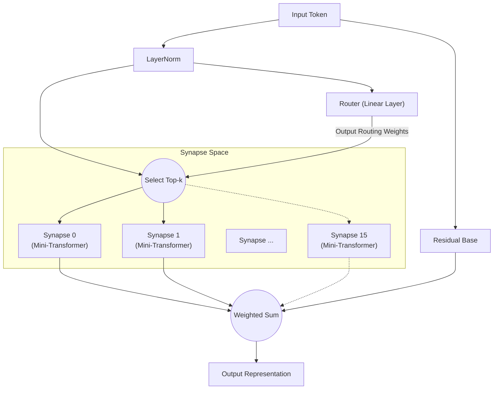

# All You Need Is Router: Динамическая Разреженная Модульность в Нейронных Сетях

**Jun Suzuki**, Независимый Исследователь

## Abstract
В последние годы модели глубокого обучения становятся всё более массивными, что приводит к взрывному росту вычислительных ресурсов, необходимых для обучения. Кроме того, когда единая монолитная сеть обучается на нескольких задачах с различными характеристиками, она крайне подвержена «катастрофическому забыванию» (Catastrophic Forgetting). В качестве решения этой проблемы мы предлагаем «Synaptic Routing Architecture (SRA)». Мы экспериментально демонстрируем, что чрезвычайно простой «однослойный маршрутизатор» без какого-либо механизма Attention способен автономно распределять задачи между множеством крошечных моделей (синапсов), полностью избегая катастрофического забывания. В заключение, для одновременного изучения сложных задач действительно необходим не массивный плотный Transformer, а «маршрутизатор», выбирающий подходящие модули на основе входных данных.

## 1. Introduction
С момента появления «Attention Is All You Need» архитектура Transformer доминирует практически во всех областях — от обработки естественного языка до компьютерного зрения и обучения с подкреплением. Однако традиционный подход плотной активации параметров ведёт к экспоненциальному росту вычислительных затрат при масштабировании.
В последнее время значительное внимание привлекает Mixture of Experts (MoE), популяризированный такими моделями, как Mixtral. SRA продвигает концепцию MoE ещё дальше, проектируя сеть, состоящую из «крошечных вычислительных блоков (синапсов)» и «лёгкого маршрутизатора, динамически комбинирующего их». В данной статье мы проверяем гипотезу о том, что «Маршрутизатор — это истинный мозг модели при мультизадачном обучении».

## 2. Architecture (SRA)
SRA — динамическая разреженная архитектура, вдохновлённая биологическим мозгом. Вместо массивного Transformer она строится из комбинации чрезвычайно лёгких компонентов.

### 2.1 The Router (All You Need Is Router)
Сердце и ключевой элемент SRA — это Маршрутизатор. Маршрутизатор сам по себе не обладает никакими сложными механизмами вроде Attention; его истинная форма — **всего лишь единственный линейный слой**.
Маршрутизатор вычисляет скалярное произведение (косинусное сходство) между скрытым состоянием входных данных и уникальным «вектором признаков (эмбеддингом)» каждого синапса, быстро определяя Top-k синапсов с наивысшими оценками (наилучшими совпадениями).

### 2.2 Tiny Synapses
Каждый синапс — это независимый крошечный модуль, состоящий из небольшого слоя Multi-Head Attention и MLP. Поскольку вычисления выполняются только синапсами, выбранными маршрутизатором, SRA достигает чрезвычайно высокой вычислительной эффективности.

### 2.3 Architecture Diagram
Диаграмма ниже иллюстрирует поток, при котором вход оценивается маршрутизатором и направляется к оптимальным синапсам.

## 3. Experiment 1: Algorithmic Reasoning
Для проверки способности маршрутизатора автономно различать задачи мы одновременно обучили единую модель SRA на четырёх задачах алгоритмического рассуждения с совершенно различными характеристиками (`copy`, `reverse`, `paren`, `addmod`).

### Результаты
После 10 000 шагов совместного обучения модель достигла **точности 100% (идеальный вывод)** по всем задачам.
Более того, извлечение информации о том, какие синапсы маршрутизатор использовал для каких задач (распределение маршрутизации), и анализ косинусного сходства между задачами дали поразительные результаты.

**Кластеризация задач Маршрутизатором (в глубоких слоях):**
- **Группа манипуляции последовательностями**: `COPY` и `REVERSE` (сходство 0,969)
- **Группа вычислений/логики**: `PAREN` и `ADDMOD` (сходство 0,858)
- Сходство между этими двумя группами составило от 0,029 до 0,336, демонстрируя чёткое разделение.

Без каких-либо человеческих инструкций маршрутизатор автономно различил «задачи, переупорядочивающие последовательности» и «задачи, требующие логики или вычислений». Он динамически разделял синапсы для похожих задач, при этом явно разделяя модули, направляя совершенно разные задачи к различным синапсам.

## 4. Experiment 2: Cross-Domain Language Modeling
Далее мы провели значительно более сложный эксперимент по «кросс-доменному языковому моделированию». Мы одновременно обучили модель на трёх доменах с совершенно различными грамматиками и словарями: `Code` (Python), `Math` (LaTeX) и `Text` (естественный язык).

### Результаты
Несмотря на всего 1 000 шагов обучения, модель смогла безупречно выводить и генерировать отступы Python, специальную нотацию LaTeX и контекст естественного языка.

**Эволюция использования синапсов и специализация:**
На ранних стадиях обучения (Warmup) все синапсы использовались равномерно. Однако к концу обучения маршрутизатор завершил «сегрегацию по доменам» следующим образом:
- Обработка `Code`: доминирование **Синапса 8**
- Обработка `Math`: обслуживание **Синапсами 10 и 13**
- Обработка `Text`: обслуживание **Синапсами 0 и 15**

Даже в сценарии, где монолитная модель пострадала бы от катастрофического забывания, маршрутизатор успешно минимизировал взаимную интерференцию, выделив каждому домену специализированные синапсы (независимые пространства параметров).

## 5. Experiment 3: Multilingual Machine Translation
Для дальнейшей проверки модульности в обработке естественного языка мы провели мультизадачное обучение многоязычному машинному переводу с использованием трёх языков с различными синтаксическими структурами (английский: SVO, французский: SVO, японский: SOV). При обучении пары «французский↔японский» были намеренно исключены для тестирования обобщения zero-shot.

### Результаты
**Автономное расхождение маршрутизации на основе синтаксической структуры (SVO/SOV):**
Анализ коэффициента использования синапсов выявил автономное формирование «SVO-общих синапсов», высоко активизирующихся при переводе между английским и французским (оба SVO), и «SOV-специализированных синапсов», использование которых возрастает только при переводе на японский (SOV). Это указывает на то, что маршрутизатор изолирует и усваивает порядок слов и синтаксические правила для каждого языка как отдельные модули.

**Перевод zero-shot и откат на опорный язык:**
При запросе невиденного перевода «французский→японский» модель продемонстрировала высокоразвитое поведение, типичное для многоязычных моделей zero-shot: она откатилась к выводу «английского», который усвоила как общее латентное представление (хаб) для обоих языков. Это доказательство того, что SRA не просто запоминает пары, а строит межъязыковое семантическое пространство.

## 6. Experiment 4: Decision Transformer (Offline RL)
Наконец, чтобы продемонстрировать применимость SRA к областям за пределами естественного языка, мы оценили её как Decision Transformer, обученный на офлайн-данных траекторий обучения с подкреплением (RL). Модели были предоставлены журналы игры (последовательности состояний, действий и наград) из двух сред с совершенно различными правилами: задача «Treasure» (навигация к цели) и задача «Escape» (бегство от врага).

### Результаты
Визуализация маршрутизации по токенам выявила поразительный феномен: **полное разделение «Восприятия» и «Политики»**.
- **Токены состояния:** При вводе токенов, указывающих координаты агента, маршрутизатор **неизменно направлял их к определённому синапсу (Expert 1)**, независимо от типа задачи. Это показывает, что модель среды для «пространственного восприятия» идеально разделяется между задачами.
- **Токены действия:** Однако на шагах генерации следующего действия (напр. UP/LEFT) маршрутизатор чётко расходился, направляя к синапсу политики для Treasure или другому синапсу политики для Escape.

Без какого-либо человеческого проектирования SRA автономно приобрела идеальную модульную структуру для обучения с подкреплением: «Воспринимать среду одними глазами, но принимать решения разными мозгами».

## 7. Conclusion
Посредством Synaptic Routing Architecture (SRA) данная статья продемонстрировала потенциал парадигмального сдвига от «пакетных вычислений с массивной моделью» к «динамическому выбору крошечных модулей».
Как свидетельствуют разнообразные экспериментальные результаты в алгоритмическом рассуждении, кросс-доменном языковом моделировании, многоязычном машинном переводе и обучении с подкреплением на основе Decision Transformer, для предотвращения мультизадачной интерференции, изоляции специфичных для задач логик и политик и совместного использования общих пространств восприятия и латентных представлений действительно необходим не гигантизм сложных механизмов Attention, а наличие простого и интеллектуального «Маршрутизатора». Действительно, **«All You Need Is Router»**.

## Appendix: Interactive Demos

Мы подготовили демо Jupyter Notebook, где вы можете интерактивно запустить и испытать архитектуру SRA и экспериментальные результаты, обсуждаемые в этой статье, прямо в вашем браузере. Смело пробуйте, открыв Google Colab по значкам ниже.

- **1. Базовая структура и валидация маршрутизации** 
  
- **2. Однозадачное обучение и специализация маршрутизации** 
  
- **3. Мультизадачное обучение и задаче-специфичная маршрутизация** 
  
- **4. Decision Transformer: разделение восприятия и действия** 
  
- **5. [Обязательно к просмотру] Эксперимент по повреждению синапсов** 
  

## Appendix: Detailed Technical Reports

Для более подробных исходных данных, журналов и процесса архитектурного проектирования экспериментов в этой статье обратитесь к следующим техническим отчётам (Markdown) в репозитории.

- **[SRA GPU Optimization & Benchmarking Report](./dev/SRA_GPU_Optimization_Report.md)**
  - Сравнение производительности (скорость обучения, потребление VRAM, прогресс точности) между базовыми моделями (Transformer/MLP) и SRA, а также результаты валидации трёх различных подходов к реализации SRA (Batched/MoE/Seq).
- **[Multilingual Translation Routing Analysis](./dev/multilingual_translation_routing_analysis.md)**
  - Анализ автономного синаптического ветвления на основе синтаксических структур SVO/SOV при многоязычном машинном переводе (английский, французский, японский) и поведения маршрутизации при переводе zero-shot.
- **[Decision Transformer Routing Analysis](./dev/decision_transformer_routing_analysis.md)**
  - Анализ офлайн обучения с подкреплением в задачах GridWorld. Детали разделения синапсов политики по задачам и разделения восприятия и действия на основе токенов «Состояние, Награда и Действие».
