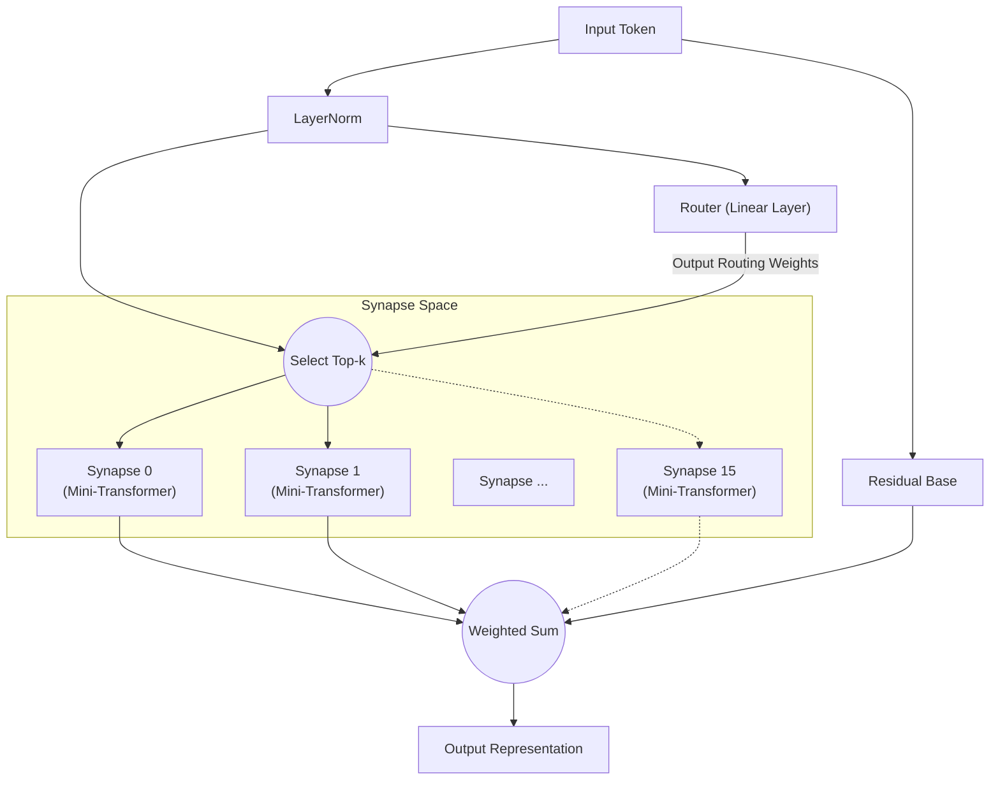

# All You Need Is Router：神经网络中的动态稀疏模块化

**Jun Suzuki**，独立研究者

## Abstract
近年来，深度学习模型不断膨胀，训练所需的计算资源呈爆炸性增长。此外，使用单一的庞大网络（单体模型）同时学习具有不同特性的多个任务时，极易产生"灾难性遗忘（Catastrophic Forgetting）"问题。本文提出"Synaptic Routing Architecture (SRA)"作为该问题的解决方案，并通过实验证明：一个不含任何Attention机制的极其简单的"单层路由器（Router）"，能够自主地将任务分配给多个微型模型（突触），从而完全避免灾难性遗忘。结论是：同时学习复杂任务所真正需要的，并非庞大而密集的Transformer，而是一个能根据输入选择合适模块的"路由器"。

## 1. Introduction
自"Attention Is All You Need"问世以来，Transformer架构已经主导了从自然语言处理到计算机视觉、强化学习等几乎所有领域。然而，密集（Dense）激活参数的传统方法导致计算成本随模型扩展呈指数级增长。
近年来，以Mixtral等为代表的MoE（Mixture of Experts）受到广泛关注。SRA在此MoE概念的基础上更进一步，设计了一种由"微型计算单元（突触）"和"动态组合它们的轻量级路由器"构成的网络。本文验证"路由器才是多任务学习中模型的大脑"这一假说。

## 2. Architecture (SRA)
SRA是一种模仿生物大脑的动态稀疏架构。它不使用庞大的Transformer，而是由极其轻量的组件组合构建而成。

### 2.1 The Router (All You Need Is Router)
SRA的核心和关键是路由器。路由器本身不具备Attention等任何复杂机制，其本质仅是 **一个单层线性层（Linear Layer）**。
路由器计算输入数据的隐藏状态与各突触所持有的"特征向量（嵌入）"之间的内积（余弦相似度），快速确定得分最高（最匹配的）Top-k个突触。

### 2.2 Tiny Synapses
每个突触是由小型Multi-Head Attention和MLP组成的独立微型模块。由于仅有被路由器选中的突触才执行计算，因此具有极高的计算效率。

### 2.3 Architecture Diagram
下图展示了输入经路由器评估后被路由到最优突触的流程。

## 3. Experiment 1: Algorithmic Reasoning
为验证路由器能否自主区分不同任务，我们将特性完全不同的4种算法推理任务（`copy`、`reverse`、`paren`、`addmod`）同时在一个SRA模型上进行训练。

### 结果
经过10,000步的联合训练，模型在所有任务上均达到了 **100%准确率（完美推理）**。
进一步，通过提取路由器在各任务中使用了哪些突触（路由分布），并分析任务间的余弦相似度，得到了令人惊叹的结果。

**路由器对任务的聚类（深层）：**
- **序列操作组**：`COPY`和`REVERSE`（相似度 0.969）
- **计算/逻辑组**：`PAREN`和`ADDMOD`（相似度 0.858）
- 以上两组之间的相似度为 0.029 ~ 0.336，呈现明确分离。

在未给予任何人工指令的情况下，路由器 **自主地识别出"重新排列序列的任务"和"需要逻辑或计算的任务"，对相似任务共享突触，对不同任务则使用明确不同的突触进行模块分离**。

## 4. Experiment 2: Cross-Domain Language Modeling
接下来，我们进行了难度更高的"跨域语言建模"实验。将语法和词汇完全不同的`Code`（Python）、`Math`（LaTeX）、`Text`（自然语言）三个领域同时进行训练。

### 结果
仅经过1,000步的训练，模型就能完美地推理和生成Python的缩进、LaTeX的特殊记法以及自然语言的上下文。

**突触使用频率的演变与专业化：**
训练初期（Warmup时），所有突触被均匀使用。但在训练后期，路由器完成了如下"按域分工"：
- `Code`处理：由 **突触 8** 主导
- `Math`处理：由 **突触 10 和 13** 负责
- `Text`处理：由 **突触 0 和 15** 负责

即使在单体模型会发生灾难性遗忘的场景下，路由器通过为每个领域分配专门的突触（独立的参数空间），成功将相互干扰降至最低。

## 5. Experiment 3: Multilingual Machine Translation
为进一步验证自然语言处理中的模块性，我们使用句法结构不同的3种语言（英语：SVO，法语：SVO，日语：SOV）进行了多语言机器翻译的多任务学习。训练时为测试零样本泛化，有意排除了"法语↔日语"翻译对。

### 结果
**基于句法结构（SVO/SOV）的自主路由分叉：**
分析突触使用率后发现，英法之间（同为SVO）翻译时高频激活的"SVO共享突触"，以及仅在翻译为日语（SOV）时使用率激增的"SOV专用突触"自主形成。这表明路由器正在将各语言的词序和句法规则作为独立模块进行分离和获取。

**零样本翻译中的枢纽语言回退：**
当要求进行未学习的"法语→日语"翻译时，模型展现了零样本多语言模型特有的高级行为：回退输出两种语言共同的潜在表示（枢纽）——"英语"。这证明SRA并非简单地记忆翻译对，而是在构建跨语言的语义空间。

## 6. Experiment 4: Decision Transformer (Offline RL)
最后，为证明SRA可应用于自然语言以外的领域，我们将其作为Decision Transformer，使用强化学习（RL）的离线轨迹数据进行验证。向模型输入了规则完全不同的两种环境（朝目标前进的"Treasure"任务和从敌人逃跑的"Escape"任务）的游戏日志（状态、动作、奖励的序列）。

### 结果
逐token可视化路由结果后，确认了一个惊人的现象：**"感知（Perception）"与"策略（Policy）"的完全分离**。
- **状态（State）Token**：当输入表示智能体自身坐标的token时，路由器无论任务类型如何，**无一例外地路由到特定突触（Expert 1）**。这表明"空间感知"的环境模型在任务间完全共享。
- **动作（Action）Token**：但在生成下一个动作（UP/LEFT等）的步骤中，路由器将路由明确分叉——分别指向Treasure用的策略突触和Escape用的策略突触。

无需任何人工设计，SRA自主获得了强化学习中理想的模块结构——"用相同的眼睛感知环境，用不同的大脑做出决策"。

## 7. Conclusion
本文通过Synaptic Routing Architecture (SRA)展示了从"使用庞大模型进行批量计算"向"微型模块的动态选择"范式转换的可能性。
正如算法推理、跨域语言建模、多语言机器翻译以及基于Decision Transformer的强化学习等多样实验结果所证明的那样：防止多任务间的干扰、分离任务特定的逻辑和策略、同时共享共同的感知和潜在空间，真正所需的并非复杂Attention机制的巨型化，而是一个简单而智能的"路由器"的存在。正所谓 **"All You Need Is Router"**。

## Appendix: Interactive Demos

我们准备了Jupyter Notebook演示，您可以在浏览器中直接运行和体验本文所介绍的SRA架构和实验结果。请点击以下徽章打开Google Colab，轻松试用。

- **1. 基础结构与路由验证** 
  
- **2. 单任务学习与路由专业化** 
  
- **3. 多任务学习与任务分流** 
  
- **4. Decision Transformer：感知与动作的分离** 
  
- **5. 【必看】突触损毁（Lesion）实验** 
  

## Appendix: Detailed Technical Reports

有关本文各实验的更详细原始数据、日志及架构设计过程，请参阅仓库中的以下技术报告（Markdown）。

- **[SRA GPU Optimization & Benchmarking Report](./dev/SRA_GPU_Optimization_Report.md)**
  - 基线（Transformer/MLP）与SRA的性能对比（训练速度、VRAM消耗、准确率趋势），以及三种SRA实现方案（Batched/MoE/Seq）的验证结果。
- **[Multilingual Translation Routing Analysis](./dev/multilingual_translation_routing_analysis.md)**
  - 多语言机器翻译（英语·法语·日语）中基于SVO/SOV句法的突触自主分叉分析及零样本翻译时的路由行为。
- **[Decision Transformer Routing Analysis](./dev/decision_transformer_routing_analysis.md)**
  - GridWorld任务中的离线强化学习分析。各任务策略突触的分离以及基于"状态·奖励·动作"token的感知与动作分离现象。
